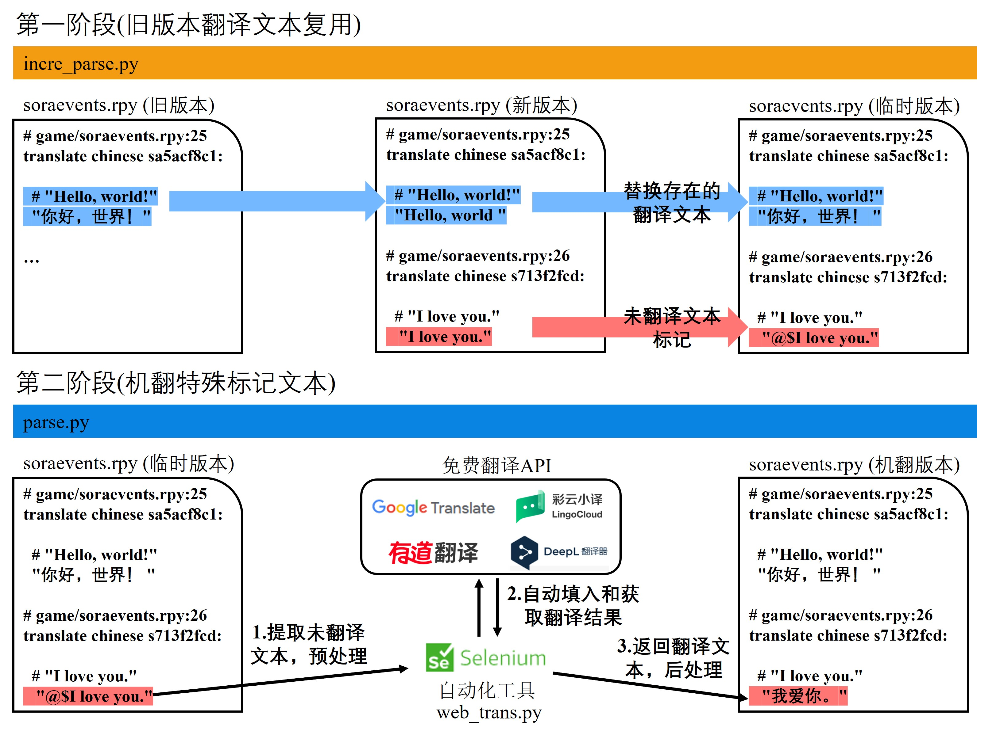
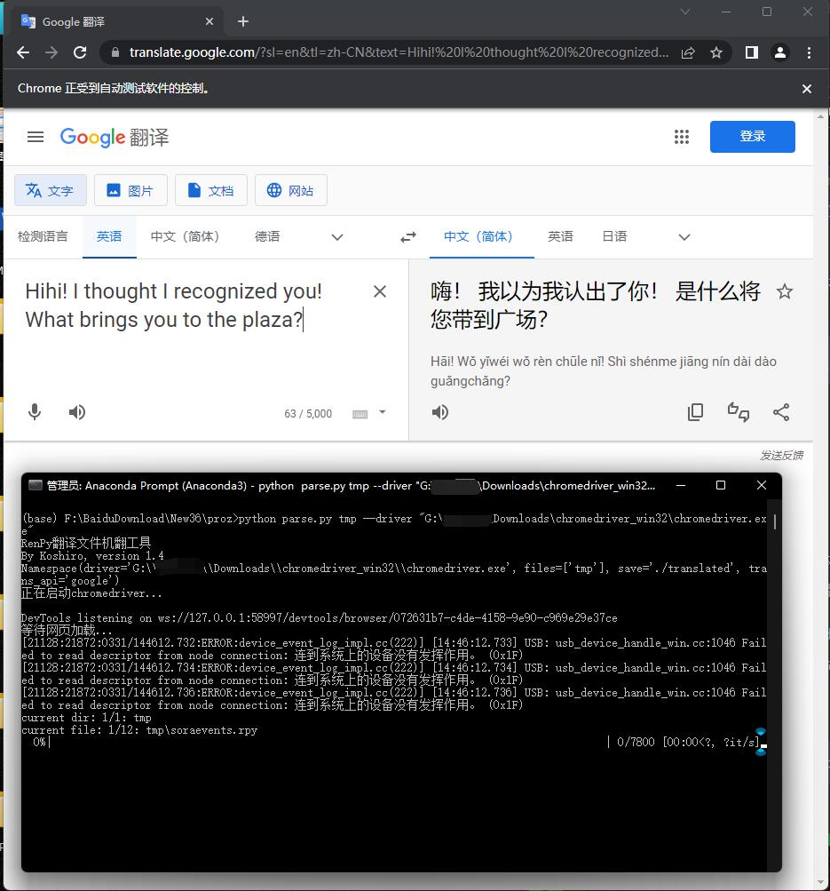
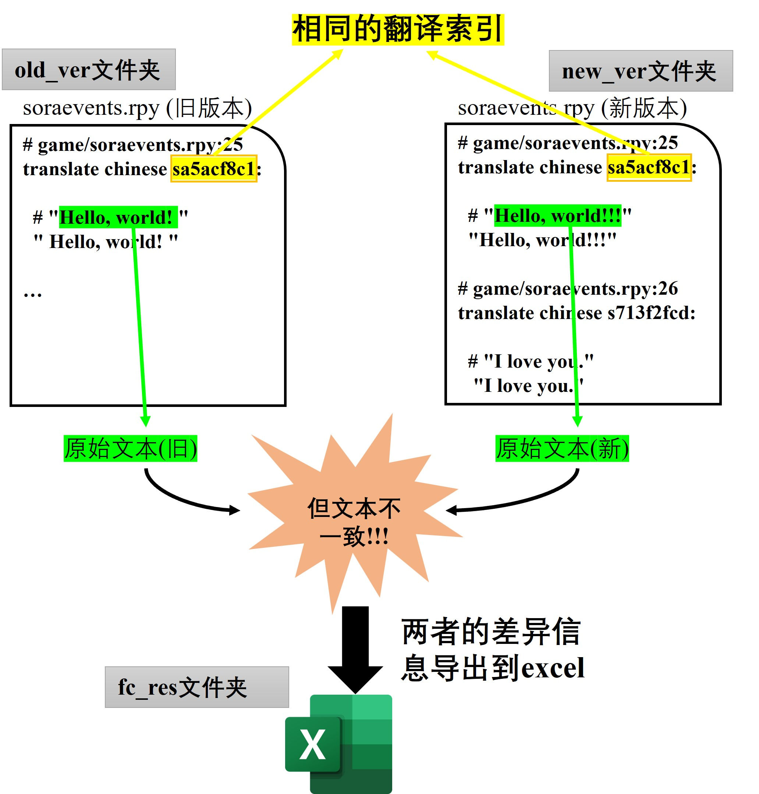

# RenPy rpy翻译文件机翻工具

- 用于迁移旧版本的rpy翻译文件和自动翻译rpy翻译文件, 机翻采用Selenium调用Chrome访问网页进行翻译。
- 可用的机翻引擎：Google翻译(速度较快，效果一般)，彩云小译(推荐，速度较快，效果好)，有道翻译(速度较快)，百度翻译(速度较快)，~~DeepL翻译器(不推荐，不稳定，速度慢)~~
- 部分代码来自[Maooookai(Mirage)](https://github.com/Maooookai/WebTranslator), [DrDRR](https://github.com/DrDRR/RenPy-WebTranslator/commits?author=DrDRR "View all commits by DrDRR")，Salute!
- 该代码仅供学习使用。

***

# <mark>⭐ 新版本V0.3.1:添加excel文件的导入导出功能，功能与`savehtml`和`loadhtml`命令类似 ⭐</mark>
# <mark>⭐ 新版本V0.3.0:改进翻译索引，减少对翻译文本的丢弃 ⭐</mark>
# <mark>⚡⚡⚡新的命令已经发布！有史以来*最最最快速*的翻译方法！！！ ⚡⚡⚡</mark>
使用`savehtml`和`loadhtml`命令，导出未翻译文本为html文件，然后借助Chrome或者Microsoft Edge浏览器翻译网页并保存覆盖原始html文件，实现翻译文本快速导入。请输入`help`命令获取详细信息。
### 使用步骤：
1. 使用`savehtml {proj_idx}`命令，导出未翻译文本为html文件，然后用Chrome或者Microsoft Edge打开它。
2. 右键，使用翻译网页功能,或者在地址栏右边找到翻译网页按钮：


3. 滚动界面让所有文本都翻译完毕。
4. `Ctrl + S` 保存文件，并覆盖原始的html文件。
5. 使用`loadhtml {proj_idx}`命令，把翻译过的html文件导入项目即可。
6. 使用`apply {proj_idx}`命令生成rpy文件即可。
---

## <mark>新的版本!!!</mark>

使用控制台方式来交互，不需要额外的文件拷贝，多线程支持（加快翻译速度）。请使用新的版本直接运行：

```shell
python3 parse_console.py
```

运行效果：


** PS： 注意后续将过度到这个版本，旧版本的`incre_parse.py`和`parse.py`将被移除。这个新版本仍在开发中，后续改进将会持续推进**

## 运行环境准备

- python3, pip install selenium prettytable tqdm pandas

- chrome, chrome driver(注意Chrome版本，如果不对请前往 [此链接](https://registry.npmmirror.com/binary.html?path=chromedriver/) 下载对应的chromedriver.exe)


## 快速开始：

首先请配置你的`chrome driver`文件路径，在`config.ini`中修改`driver
CHROM`选项：

```ini
[GLOBAL]
# log path
LOG_PATH=./projz/log
# Save dir for project indexes or generate rpy files
PROJECT_PATH=./projz
# The number of thread used to translate. The larger the value, the faster the translation
NUM_WORKERS=2
# The path of chrome driver
CHROME_DRIVER=D:\Users\Surface Book2\Downloads\chromedriver_win32\chromedriver.exe
```

然后打开控制台交互程序：

```shell
python3 parse_console.py
```

### 1.从旧版本renpy翻译构建(如果没有，请跳过)：

构建一个旧版本翻译项目，输入命令`old`或者`o`：

```shell
o {tl_dir} {游戏名} {版本}
```

`{tl_dir}`为游戏翻译文件所在目录，例如`D:\my_renpy\game\tl\chinese`。`{游戏名}`和`{版本}`请自定义，注意保存项目文件时候会用到它们（保存的项目文件为：`{游戏名}_{版本}.pt`），确保它们符合系统文件名要求。

一个例子：


然后试试`list`或`l`命令，他将列出当前翻译项目：

```shell
l
```

效果图：


### 2.创建新版本的翻译项目

构建一个新版本翻译项目，输入命令`new`或者`n`：

```shell
n {tl_dir} {游戏名} {版本}
```

它参数说明和`old`命令类似。

一个例子：


**注意：**

注意，我们使用renpy SDK生成翻译文件时候需要保留原始文本，不要勾选未翻译生成空字符串的选项：


之后生成的ryp文件应该是这样的：

> ```
> # game/ImaniEvents.rpy:11
> translate chinese callimanimorning_88744462:
> 
>     # "She doesn’t pick up."
>     "She doesn’t pick up."
> ```

只有这样格式的ryp，才能代码才可以识别原始文本然后进行替换。

### 3.从旧版本翻译项目合并到新版本中（如果你在第1步跳过，这里也请跳过）

首先查看我们已有项目，使用`l`命令：


之后我们使用`merge`或者`m`命令来将旧版本`mygame v0.0.1`已有翻译文本被合并到新版`mygame v0.0.2`中，这会使得新版中存在的旧版本文本得到翻译，充分利用了旧版本的翻译文本。我们只需指定它们的索引进行操作：

```shell
 merge {旧翻译项目索引} {新翻译项目索引}
```

一个例子：


这了需要输入`Y`或`y`来确认指令执行。输入完后，我们可以看到我们利用旧版本`mygame v0.0.1`中13条翻译过的文本到新版本`mygame v0.0.2`中，现在我们只需要翻译剩下的7条即可！！！

再次输入`l`命令看看：


我们看到新版本`mygame v0.0.2`中已经翻译文本和为翻译的文本数量发生改变，这说明`merge`起作用了。

### 4.使用翻译引擎翻译剩余的文本：

使用`translate`或者`t`命令，只需要指定要翻译项目索引和翻译引擎即可：

```shell
 t {project_idx} {translation_API}
```

可用的`{translation_API}`有caiyu, google, baidu, and youdao。我们移除旧版本的`deepl`，因为它的问题很多。

一个例子：


这里程序等待你的确认以开始执行。我们可以看到启动两个窗口，这里你可以配置你的翻译目标，如设置从英语到中文的翻译：


记得，每个窗口保证相同的翻译目标设置。然后在输入`Y`或`y`在进行下一步操作，程序开始自动翻译：


我们使用`l`可以看到`mygame v0.0.2`已经翻译完了。

### 5.生成&替换

使用`apply`或`a`命令生成真实翻译文件，这也就是说：我么们之前操作并不会对原始文件进行修改，也不需要像旧版本那样拷贝rpy文件：

```shell
 a {project_idx}
```

一个例子：


你可以在`./projz\mygame_v0.0.2`目录下找到它们，而且它具有和原始路径一样的目录结构：


这意味你可以将这个文件夹剪切到新版本游戏中的原始目录进行替换，当然请记得做好备份工作。

**注意：**

使用翻译引擎的翻译文本会带有`@@`，这用于后期润色工作。如果你不需要它们，请使用VS Code全文替换功能删除它们。

## Todo List:
- ~~添加excel导入导出功能~~ (Done at 20230819)
- 添加英语文档

---

## 以下内容为旧版本(V0.1.0)内容，不久后将被移除，请使用上面的新版本！！！

## 1.目的

在同一个RenPy游戏中，对于一个已经精翻的rpy文件（比如，来自某个版本V0.28），里面的翻译文本其实在新版本的rpy文件（V0.29）中是可以复用的。因此我们可以先把旧版本可用翻译文本替换到新版本中，然后对于那些没有替换的文本再进行机翻，大大地节省时间。

## 2.流程

本工具分成两个阶段的流程：

1. `incre_parse.py` 将新版本的rpy文件中可以在旧版rpy文件找到的翻译文本进行进行替换，而对于没有旧版rpy文件没有翻译文本，进行标记，交给下一个阶段进行机翻。此时会生成一个临时版本的rpy文件，其格式按照新版本的rpy，但是如果文本的翻译可以在旧版rpy文件找到，则使用旧版rpy文件的翻译文本，如果找不到对应的翻译文本则对该文本进行特殊标记。

2. `parse.py`遍历上一个阶段的临时版本的rpy文件，如果某行文本含有特殊标记，则调用翻译API进行翻译，否则保持不变。完成后会生成一个翻译好的rpy文件。(<mark>为了辨别机翻文本，第二阶段后的机翻文本仍在文本前进行特殊标记`@@`，方便后期手动润色</mark>)

示意图：


## 3.运行环境准备

- python 3, 并安装selenium库

- chrome, chrome driver(注意Chrome版本，如果不对请前往 [此链接](https://registry.npmmirror.com/binary.html?path=chromedriver/) 下载对应的chromedriver.exe)

- 科学上网工具(如果使用Google翻译就要用到，现在国内谷歌翻译已经不可用，请使用全局代理模式，保持网络稳定)

## 4.文件准备

1. 把第3节 *3.运行环境准备*  下好chrome driver驱动解压到任意一个目录下，等下要用到。

2. 将旧版本的ryp文件放置到当前代码目录`./old`文件夹下，新版本的ryp文件当前代码目录`./new`文件夹下。放置后的文件目录结构如下（这两个文件夹目录可以通过命令行参数`-o,-n`指定，但是这两个文件夹**必须存在**）：

```
projz/
└── old/
    ├── dayaievents.rpy
    ├── erukaevents.rpy
    └── ...(旧版本rpy，如果没有旧版本rpy可以不放，不影响代码运行)
├── new/
    ├── dayaievents.rpy
    ├── erukaevents.rpy
    └── ...(新版本rpy)
├── trans/
├── util/
├── correct_rawtext.py
├── incre_parse.py
├── parse.py
├── README.md
└── revert.py
```

## 5.运行

### 5.1 第一阶段(旧版本翻译文本复用)

#### 5.1.1 参数说明

`incre_parse.py`参数如下

```shell
python incre_parse.py [-o OLD_DIR] [-n NEW_DIR] [-s SAVE]
```

- `-o OLD_DIR`表示第4节 `4.文件准备` 的旧版本的ryp文件目录，默认为`./old`

- `-n NEW_DIR`表示第4节 `4.文件准备` 的新版本的ryp文件目录，默认为`./new`

- `-s SAVE`表示保存临时生成的ryp文件目录，默认为`./tmp`

#### 5.1.2 执行命令

因此，如果如果按第4节 `4.文件准备`放置好ryp文件后，直接运行下面命令就行了：

```shell
python incre_parse.py
```

上面的命令和下面的命令是等价的：

```shell
python incre_parse.py -o ./old -n ./new -s ./tmp
```

**注意**：`incre_parse.py`不会对文件夹进行递归扫描，只扫描一级目录下的rpy文件。

#### 5.1.3 执行效果

执行完毕后，代码目录会多出一个`tmp`文件夹下，里面的rpy文件名和`./new`文件夹的相同：

```
projz/
└── old/
    ├── dayaievents.rpy
    ├── erukaevents.rpy
    └── ...(旧版本rpy，如果没有旧版本rpy可以不放，不影响代码运行)
├── new/
    ├── dayaievents.rpy
    ├── erukaevents.rpy
    └── ...(新版本rpy)
├── tmp/
    ├── dayaievents.rpy
    ├── erukaevents.rpy
    └── ...(临时rpy，包含来自旧版本翻译和未翻译的文本)
├── trans/
├── util/
├── correct_rawtext.py
├── incre_parse.py
├── parse.py
├── README.md
└── revert.py
```

同时，还会代码目录下生成一个`tran_summary.txt`文件，统计每个文件中复用旧版本的rpy文件翻译的行数和需要机翻行数，文件内容类似下面：

> 2023-03-31 12:44:57 
> dayaievents.rpy[total line(s):2967] is translated with 2937 translated line(s) and 30 untranslated line(s). 
> erukaevents.rpy[total line(s):18315] is translated with 18082 translated line(s) and 233 untranslated line(s). 
> dreamevents.rpy[total line(s):1164] is translated with 1007 translated line(s) and 157 untranslated line(s). 
> 3 rpy files are translated with 22026 translated line(s) and 420 untranslated line(s). 

然后我们就可以知道，我们复用多少行翻译和需要翻译多少行。

#### 5.1.4 代码原理

在旧版本rpy中，例如：

>         # renpy/common/00accessibility.rpy:33
>         old "selected"
>         new "选择"
>     
>         # game/ImaniEvents.rpy:11
>     translate chinese callimanimorning_88744462:
>     
>         # "She doesn’t pick up."
>         "她没有接听。"

我们可以把`old "selected"`中的原始文本`selected`当成字典的key，而`new "选择"`中的翻译文本`选择`当成字典的value，这样就可以得到一个原始文本到翻译文本的映射（`"selected"->"选择"`），因此我们在旧版本rpy文件工作就是如何识别原始文本和翻译文本，然后构建这个翻译字典即可。

对于新的rpy文件我们只要做的是提取原始文本然后用翻译字典中有进行替换就行了。注意，我们使用renpy SDK生成翻译文件时候需要保留原始文本，不要勾选未翻译生成空字符串的选项：


之后生成的ryp文件应该是这样的：

>     # game/ImaniEvents.rpy:11
>     translate chinese callimanimorning_88744462:
>     
>         # "She doesn’t pick up."
>         "She doesn’t pick up."

只有这样格式的ryp，才能代码才可以识别原始文本然后进行替换。注意有的旧的翻译ryp文件可能会把末尾的`"`给弄没了，变成这样（文本`# "She doesn’t pick up.`后面少了一个引号）：

> ```
> # game/ImaniEvents.rpy:11
> translate chinese callimanimorning_88744462:
> 
>     # "She doesn’t pick up.
>     "她没有接听。"
> ```

这种ryp文件需要手动加上在末尾加上引号，才能进行处理，否则代码会报不匹配异常（可以看到在哪一行出了问题），后续会上传该校正这种错误的代码（`correct_rawtext.py`）。我们匹配规则是：`# "She doesn’t pick up"`（代码中对应raw_text）对应`"她没有接听。"`（代码中对应new_text），且这两行必须相邻的。

如果翻译字典不存在的这段翻译的文本，我们为这个文本开头加上特殊标记`@$`表示这段文本需要进行翻译：

> ```
> # game/ImaniEvents.rpy:11
> translate chinese callimanimorning_88744462:
> 
>     # "She doesn’t pick up."
>     "@$She doesn’t pick up."
> 
> # game/diceevents.rpy:40
> translate chinese diceevent1_064b67cc:
> 
>     # dic "..."
>     dic "..."
> ```

第二阶段就是把这些特殊标记的文本进行机翻。此外,对于一些没有需要翻译内容的文本（如没有字母的文本）也不会添加特殊标记，如上面的`dic "..."`。

### 5.2 第二阶段(机翻特殊标记文本)

#### 5.2.1 参数说明

`parse.py`参数如下

```shell
python parse.py FILENAME/DIRNAME --driver DRIVER [-t API_NAME] [--no_mark] [-s SAVE]
```

- `FILENAME/DIRNAME`表示要进行机翻的rpy目录或者rpy文件路径，不会递归扫描文件夹。
  
  例如(下面命令会机翻文件夹`./tmp`和文件夹`./my_typs`下的所有rpy文件和当前目录下的一个rpy文件`a.rpy`)：
  
  ```
  python parse.py ./tmp a.rpy ./my_typs
  ```

- `--driver DRIVER`表示第3节 `4.文件准备` 中解压好的chrom edriver文件的路径，例如：
  
  ```
  --driver "G:\Admin\Downloads\chromedriver_win32\chromedriver.exe"
  ```
  
  如果觉得每次都要指定很麻烦，请在`parse.py`设置该参数的默认值：
  
  ```python
  parser.add_argument(
      "--driver",
      type=str,
      default=r"G:\Admin\Downloads\chromedriver_win32\chromedriver.exer",
      required=True,
      help="the executable path for the chrome driver",
  )
  ```

- `-t API_NAME`表示使用翻译API，默认为`caiyun`，可选的有：`['caiyun', 'youdao', 'deepl', 'google', 'baidu']`，~~建议使用google翻译，对于文本的中字符格式化标签能保留下来，即"{i}Hello world{/i}"翻译后”{i}你好世界{/i}“。对于其他翻译API我在翻译前手动去除了这些标签：~~
  
  ```python
  def translate(self, rawtext):
      res = strip_breaks(rawtext) # 去除换行符，和文本头尾的空白字符
      res = strip_tags(res)  # 去除字符格式化标签
  ```
  
  注意：由于存在问题，google翻译前也去除了这些标签。

- `-s SAVE`表示保存机翻ryp文件目录，默认为`./translated`。如果`FILENAME/DIRNAME`参数含有文件夹，则会在`./translated`目录生成一个同名的文件夹，然后保存机翻的rpy文件到这个同名的文件夹里面；如果`FILENAME/DIRNAME`参数含文件，则直接在`./translated`生成同名的机翻的rpy文件。

- `--no_mark`表示是否去除机翻文本前面特殊标记`@@`，如果指定该参数则会去除，默认不会去除。如果是为了后期润色翻译文本，请不要指定该参数，后面通过查找`@@`标记来手工润色文本。

#### 5.2.2 执行命令

我们指定第一阶段保存临时rpy文件的目录`./tmp`为我们要机翻的目录，同时指定chrome驱动文件位置:

```shell
python parse.py ./tmp --driver "G:\Admin\Downloads\chromedriver_win32\chromedriver.exe"
```

#### 5.2.3 执行效果



执行完毕后，代码目录会多出一个`tmp`文件夹下，里面的rpy文件名和`./new`文件夹的相同：

```
projz/
├── old/
    ├── dayaievents.rpy
    ├── erukaevents.rpy
    └── ...(旧版本rpy，如果没有旧版本rpy可以不放，不影响代码运行)
├── new/
    ├── dayaievents.rpy
    ├── erukaevents.rpy
    └── ...(新版本rpy)
├── tmp/
    ├── dayaievents.rpy
    ├── erukaevents.rpy
    └── ...(临时rpy，包含来自旧版本翻译和未翻译的文本)
├── translated/
    └── tmp/
        ├── dayaievents.rpy
        ├── erukaevents.rpy
        └── ...(机翻rpy)
├── trans/
├── util/
├── correct_rawtext.py
├── incre_parse.py
├── parse.py
├── README.md
└── revert.py
```

#### 5.1.4 代码原理

扫描第一阶段的临时rpy文件（例如下面），提取含有特殊标记`@$`文本调用翻译API进行翻译。

> ```
> # game/ImaniEvents.rpy:11
> translate chinese callimanimorning_88744462:
> 
>     # "She doesn’t pick up."
>     "@$She doesn’t pick up."
> 
> # game/diceevents.rpy:40
> translate chinese diceevent1_064b67cc:
> 
>     # dic "..."
>     dic "..."
> ```

- 由于调用翻译API过程中可能出错导致文本没有被翻译到，还需要进行翻译，我们仍保留特殊标记，事后可以自己进行翻译（Ctrl + F 查找这个特殊标记`@$`），或者把在`./translated`目录下对应的ryp文件剪切到第一阶段的`./tmp`目录下就行（替换临时对应ryp），重新执行代码即可，注意`./translated`目录下对应的ryp文件要删掉（由于检查点机制的存在）。

- 第二阶段翻译代码具有检查点的机制，也就是说：当`./tmp`某个文件翻译一半时候，程序寄了，导致`./translated`目录下对应机翻rpy文件部分内容缺失，则第二阶段代码下次重新运行的时候会从上次这个rpy文件中断的行（对比`./translated`目录下对应的rpy文件）继续翻译。

- 此外，由于这个检查点的机制存在，如果整个翻译完的文件则不会进行重复翻译。因此`./translated`目录下内容完整的rpy文件（行数和`./tmp`对应的rpy文件一样），不会进行重复翻译。

- 对于存在变量名的的文本，例如，待翻译的文本为：
  
  ```
  I love you, [player].
  ```
  
  送入翻译API前，会把`[player]`替换为`T0V`:
  
  ```
  I love you, T0V.
  ```
  
  替换后再送入翻译API后，再把翻译结果的`T0V`替换为`[player]`:
  
  ```
  我爱你, [player].
  ```

- 对于存在字符格式标签的文本，如果使用非Google翻译API会把标签去除（Google翻译带标签的文本后仍会保留标签，因此翻译前不用去除标签），原始本文：
  
  ```
  <i> I love you </i>
  ```
  
  去除后：
  
  ```
    I love you 
  ```
  
  然后再送入翻译API中。这做是因为非Google翻译API会把字符格式标签给翻译了，导致运行游戏时候报错。如果标签只出现文本的头尾，那么是可以翻译后重新加上去的，但是代码没有这样做（懒）。

## 6.自定义翻译引擎API

在`./trans/web_trans.py`创建一个类，并继承抽象类`web_translator`即可，然后重写里面的`translate`方法。

```python
# Abstract translator
class web_translator(translator):
    # ...

class mytransapi(web_translator):
    def __init__(self, driver_path):
        super().__init__(driver_path)
        # Your code here

    def translate(self, rawtext):
        # Your code here
```

然后在`parse.py`文件，为命令行参数`-t` 添加这个自定义类的类名到choices列表里即可：

```python
parser.add_argument(
    "-t",
    "--trans_api",
    type=str,
    default='google',
    choices=['caiyun', 'youdao', 'deepl', 'google', 'mytransapi'],
    help="the translation API to use",
)
```

## 工具文件

- `correct_rawtext.py`:见5.1.4 代码原理，它会把旧版本中`rwa text`末尾缺失引号加上去。没有参数，在代码中直接指定要添加缺失引号rpy文件的文件夹，默认为`./old`,保存到`./old_tmp`目录。

- `revert.py`它将翻译的文本替换成原始文本，可以看作是`incre_parse.py`的逆过程。
  
  参数：`-o`要含有翻译文本的rpy文件的文件夹，默认值`./source` ；`-s`保存替换原始文本的rpy文件的文件夹，默认值`./reverted`

- `compare.py`:游戏作者可能在新版本中校正旧版本的某些文本，这对导致我们第一阶段`incre_parse.py`某些文本得不到复用，因此这个工具类根据文本在原代码中的位置(叫做<mark>翻译索引</mark>)作为key，而对应原始文本作为value，构建字典。
   然后我们分别为新旧版本的rpy文件构建这样字典，然后根据两者共有的<mark>翻译索引</mark>进行对相应原始文本进行比较，然后把那些原始文本不一样的项目到处到excel中，方便查看。
  
  注意：修改代码26行的`chinese`（生成翻译的文件名）来匹配原rpy文件的`translate chinese XXXX`
  
  ```python
  regex_trans = re.compile(r'^translate chinese ([^\r\n:]*):')
  ```
  
  示意图：
  
  参数：`-o`含有旧版本的rpy文件的文件夹，默认值`./old` ；`-n`含有新版本的rpy文件的文件夹，默认值`./new`；`-s`保存excel文件保存位置，默认值`./fc_res`

## 其他问题

- 虽然在 `5.1.4 代码原理` 说过Google翻译可以翻译带标签的文本，但是标签如果有参数之类的可能会在标签加空格导致代码出错。因此，如果想要去除标签，在`./trans/web_trans.py`代码中的`google`类的`translate`方法调用`strip_tags(res)`即可：
  
  ```python
  def translate(self, rawtext):
        res = strip_breaks(rawtext)
        res = strip_tags(res)  # 加上这个
  ```

- 翻译文本中含有Emoji表情将导致第二阶段崩溃，请手动翻译在`./tmp`文件夹下的对应文件含有带有Emoji表情的文本，并去除特殊标记`@$`，然后在再执行第二阶段的代码。

## Todo

1. 翻译API的translate实现对于获取翻译结果判断可能有问题（过长文本的翻译结果可能缺失），由于个人时间和能力有限，需要进一步完善，例如优化获取翻译结果逻辑，减少睡眠时间来提高翻译效率。
2. 由于翻译网站可能发生变化，原有代码可能不能使用，需要进行适配。欢迎XDM对代码进行贡献。
3. 视频演示？Emmmm......
