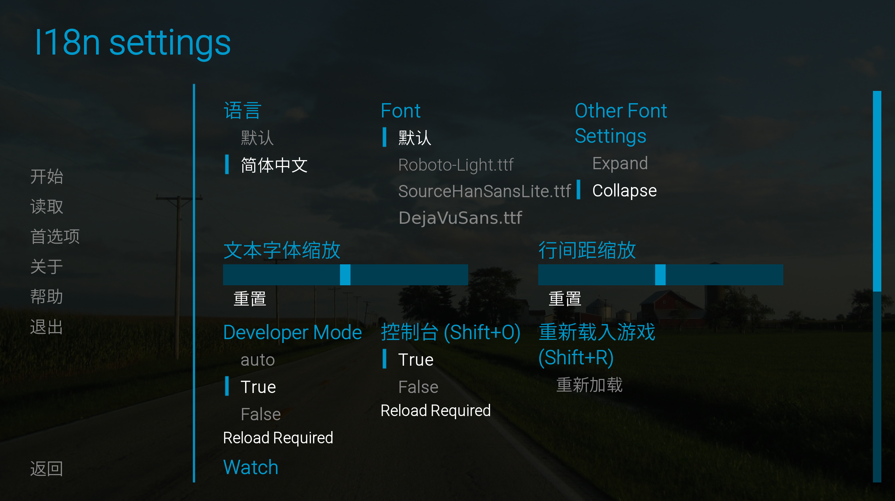

<div align="center">
  
  <br />

[](https://github.com/abse4411/projz_renpy_translation)
[](https://github.com/abse4411/projz_renpy_translation/blob/devp/LICENSE)

[📘文档（Chinese only）](#) |
[🛠安装](#运行环境准备) |
[💡建议](https://github.com/abse4411/projz_renpy_translation/issues)

简体中文 | [English (N/A)](#帮助我们翻译help-us-translate-the-documentation)

</div>

# ✨新版本V0.4.0

该版本可以支持以下功能：
- 无需RenPy SDK即可生成rpy翻译文件，和原生体验类似
- 可以检测和发现rpy文件中的错误
- 实现游戏注入，可以为RenPy游戏提供语言和字体管理菜单，支持实时生效
- 更简洁，规范的代码，支持实现自定义的翻译接口

现在正在开发中,🚨注意🚨该版本不兼容V0.4.0之前的数据，要使用旧版本请到[这里](https://github.com/abse4411/projz_renpy_translation/tree/9e257770e9b30011b1053da28634c41d958d0fc5)。

# 📈进度

## 已完成：

- Web翻译，仅限google: translate 1 -t web -n google -lang chinese
- AI翻译: translate 1 -t ai -n mbart50 -lang chinese
- 翻译文本潜在错误检查:
  使用`inspect`命令检查已翻译文本中缺失的变量名(如[var])或者样式化标签(如{font})或者转义字符: inspect 1 -l chinese。
  在生成的excel文件完成修复后，使用`updateexcel`命令导入修复的文本：updateexcel 1 -l chinese

## 待完成

- 一些其他命令

# 🛫快速开始

## 1.启动(注意我们使用Python3.8的环境)

```bash
python main.py
```

## 2.创建TranslationIndex

启动后，控制台输入：

```bash
new D:\games\renpy_game_demo -n my_game
```

- `D:\games\renpy_game_demo` 是您的RenPy游戏根目录。
- `-n my_game`是可选的，指定TranslationIndex的别名，因此您可以使用别名代替序号。

> **🚨注意🚨**<br />
> 在运行该命令前，请确保游戏中所有rpa文件被解压(使用[rpatool](https://github.com/Shizmob/rpatool)或
[UnRPA](https://github.com/Lattyware/unrpa))，rpyc转为rpy文件(
> 必须的，不然有些大部分rpy文件无法扫描，使用[unrpyc](https://github.com/CensoredUsername/unrpyc)工具)。
> 或者使用这个集成unrpa和unrypc的工具：[UnRen](https://github.com/VepsrP/UnRen-Gideon-mod-)。

确保以上事项，后输入`ls`命令查看我们创建的TranslationIndex：

```bash
ls
```

输出类似：

```text
Note that: Translation Stats list translated/untranslated lines of dialogue and string for each language.
+-------+---------------+-------------------+------------------+-----------------------------------------------------+
| Index |  Nickname:tag | Translation Stats | Injection state  |                      Game info                      |
+-------+---------------+-------------------+------------------+-----------------------------------------------------+
|   1   |  my_game:None |                   |   Base   True    |       renpy_game_demo-V0.1, Ren'Py 7.4.11.2266      |
|       |               |                   |                  |                D:\games\renpy_game_demo             |
+-------+---------------+-------------------+------------------+-----------------------------------------------------+
```

注意`Injection state`中`Base   True`，这表示我们成功识别并注入该游戏。

## 3.导入一个语言的翻译

启动后，控制台输入：

```bash
import my_game -l schinese
```

- `my_game` 指定导入的TranslationIndex的别名，也可以用索引：1
- `-l schinese` 创建一个名为`schinese`的翻译，
- 这会读取`D:\games\renpy_game_demo\game\tl\schinese`的已经翻译和未翻译的文本

输入`ls`命令查看我们创建的翻译：

```bash
ls
```

输出类似：

```text
Note that: Translation Stats list translated/untranslated lines of dialogue and string for each language.
+-------+---------------+-----------------------------------------+------------------+-----------------------------------------------------+
| Index |  Nickname:tag |            Translation Stats            | Injection state  |                      Game info                      |
+-------+---------------+-----------------------------------------+------------------+-----------------------------------------------------+
|   1   |  my_game:None |   Language   Dialogue   String   Sum    |   Base   True    |       renpy_game_demo-V0.1, Ren'Py 7.4.11.2266      |
|       |               |   schinese    0/940     0/384    1324   |                  |                D:\games\renpy_game_demo             |
+-------+---------------+-----------------------------------------+------------------+-----------------------------------------------------+
```

## 3.使用翻译命令进行翻译

为方便这里使用`savehtml`和`loadhtml`命令进行快速翻译。
Web翻译和AI翻译可用，请查看[帮助](#命令帮助)
，或者参考以前版本的说明：[Web翻译](https://github.com/abse4411/projz_renpy_translation?tab=readme-ov-file#4%E4%BD%BF%E7%94%A8%E7%BF%BB%E8%AF%91%E5%BC%95%E6%93%8E%E7%BF%BB%E8%AF%91%E5%89%A9%E4%BD%99%E7%9A%84%E6%96%87%E6%9C%AC), [AI翻译](https://github.com/abse4411/projz_renpy_translation?tab=readme-ov-file#%E4%BD%BF%E7%94%A8dltranslate%E5%91%BD%E4%BB%A4%E8%BF%9B%E8%A1%8Cai%E7%BF%BB%E8%AF%91)。
`saveexcel`, `loadexcel`
命令查看：[使用saveexcel和loadexcel⚡快速⚡翻译](https://github.com/abse4411/projz_renpy_translation?tab=readme-ov-file#%E4%BD%BF%E7%94%A8saveexcel%E5%92%8Cloadexcel%E5%BF%AB%E9%80%9F%E7%BF%BB%E8%AF%91)

现在我们用`savehtml`和`loadhtml`命令来翻译：

```bash
sh 1 -l schinese
```

输出类似：

```text
1320 untranslated lines are saved to ./projz\html\my_game_None_schinese.html.
```

然后使用Chrome或者Microsoft
Edge打开它，右键菜单翻译为指定语言后，Ctrl+S保存该html文件并覆盖原始的`my_game_None_schinese.html`。
这个详细步骤参考[使用savehtml和loadhtml⚡快速⚡翻译（浏览器自带网页翻译）](https://github.com/abse4411/projz_renpy_translation?tab=readme-ov-file#%E4%BD%BF%E7%94%A8savehtml%E5%92%8Cloadhtml%E5%BF%AB%E9%80%9F%E7%BF%BB%E8%AF%91%E6%B5%8F%E8%A7%88%E5%99%A8%E8%87%AA%E5%B8%A6%E7%BD%91%E9%A1%B5%E7%BF%BB%E8%AF%91)

然后使用`loadhtml`命令导入翻译：

```bash
lh 1 -l schinese
```

输出类似：

```text
...
...
Find 1229 translated lines, and discord 91 lines
schinese: 854 updated dialogue translations, 375 updated string translations. [use:1229, discord:0, total:1229]
```

输入`ls`命令查看我们导入的翻译结果，输出类似：

```text
Note that: Translation Stats list translated/untranslated lines of dialogue and string for each language.
+-------+---------------+-----------------------------------------+------------------+-----------------------------------------------------+
| Index |  Nickname:tag |            Translation Stats            | Injection state  |                      Game info                      |
+-------+---------------+-----------------------------------------+------------------+-----------------------------------------------------+
|   1   |  my_game:None |   Language   Dialogue   String   Sum    |   Base   True    |       renpy_game_demo-V0.1, Ren'Py 7.4.11.2266      |
|       |               |   schinese    856/84    377/7    1324   |                  |                D:\games\renpy_game_demo             |
+-------+---------------+-----------------------------------------+------------------+-----------------------------------------------------+
```

## 4.生成翻译rpy

然后使用`generate`命令来生成翻译rpy文件到游戏：

```bash
generate 1 -l schinese
```

输出类似：

```text
...
...
schinese: dialogue translation: using 856 and missing 84, string translation: using 377 and missing 7
```

需要注意的是，如果`game/tl/{lang}`已经有rpy文件，里面包含翻译文本不会被覆盖，一般`generate`只会添加rpy文件没有的
翻译文本(追加模式)。如果您在TranslationIndex项目中修改了rpy文件已经存在翻译，要把TranslationIndex最新翻译应用
到rpy文件中，请添加`-f`参数，这将删除`game/tl/{lang}`所有rpy/rpyc文件。

## 5.注入我们的I18N插件

在此之前，请手动下载字体文件到`resources/fonts`文件下，下载连接可以在`resources/fonts/readme.txt`找到，
下载完后`resources/fonts`如下内容(请注意字体的版权问题)：

```text
projz_renpy-translator/
    |–– resources/
        –– DejaVuSans.ttf
        –– SourceHanSansLite.ttf
```

使用`inject`命令注入我们提供的I18N插件，其支持修改语言和字体：

```bash
inject 1 -t I18n
```

输入`ls`命令查看注入结果，输出类似：

```text
Note that: Translation Stats list translated/untranslated lines of dialogue and string for each language.
+-------+---------------+-----------------------------------------+------------------+-----------------------------------------------------+
| Index |  Nickname:tag |            Translation Stats            | Injection state  |                      Game info                      |
+-------+---------------+-----------------------------------------+------------------+-----------------------------------------------------+
|   1   |  my_game:None |   Language   Dialogue   String   Sum    |   Base   True    |       renpy_game_demo-V0.1, Ren'Py 7.4.11.2266      |
|       |               |   schinese    856/84    377/7    1324   |   I18n   True    |                D:\games\renpy_game_demo             |
+-------+---------------+-----------------------------------------+------------------+-----------------------------------------------------+
```

您也可以手动启动游戏或者使用`launch`的命令:

```bash
launch 1
```

打开游戏后使用Ctrl+I打开该I18N插件，或者在游戏的设置界面找到名为`I18n settings`的按钮
(按钮的注入需要将screens.rpy文件注入我们的按钮，因此需要把screens.rpyc转为screens.rpy)：




> **💡额外内容💡**<br />
> 你可以在[config.yaml](config.yaml)文件配置生成I18N插件语言设置和字体内容，`inject`命令
> 生成的语言取决于`game/tl`下的非`None`文件夹与[config.yaml](config.yaml)的`lang_map`配置的语言交集，
> 字体可以在[config.yaml](config.yaml)的`fonts`添加。

## 命令帮助

输入`help`命令，打印所有命令的描述和用法，要查看某个命令的所有参数，
请在该命令后面加入一个`-h`选项：

```bash
new -h
```

这将打印`new`命令的详细用法。

> **🍻最后🍻**<br />
> 我们欢迎你集成您的翻译实现到我们的项目中，或者帮助我们翻译文档页面。

# 🗒Todo List:

1. [ ] 添加英语文档
2. [ ] 其他翻译命令
3. [ ] 翻译时检查

# 🔗Acknowledgement

我们参考或调用代码：

* 早期项目代码（Web翻译）参考：[Maooookai(Mirage)](https://github.com/Maooookai/WebTranslator), [DrDRR](https://github.com/DrDRR/RenPy-WebTranslator/commits?author=DrDRR "View all commits by DrDRR")
* 使用的AI翻译库：[dl-translate](https://github.com/xhluca/dl-translate)
* 其他使用的python库见：[requirements.txt](./requirements.txt)
