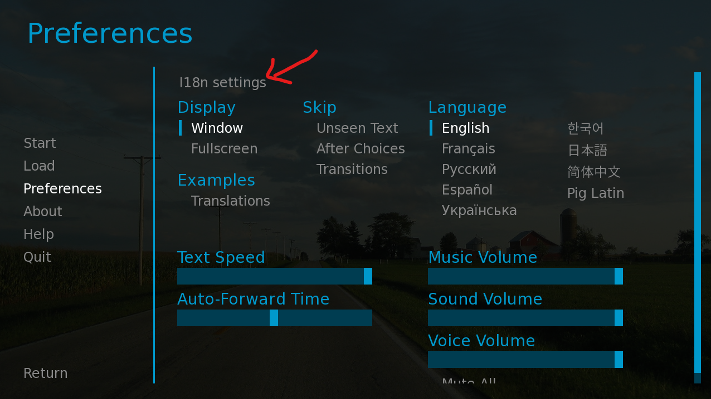
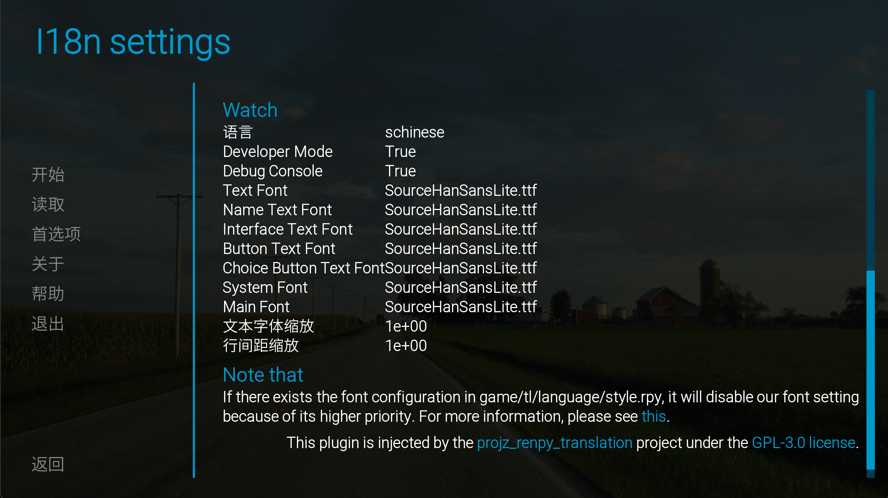

<div align="center">
  
  <br />

[](https://github.com/abse4411/projz_renpy_translation)
[](https://github.com/abse4411/projz_renpy_translation/blob/devp/LICENSE)

[📘Document](#get-started) |
[🛠Install](#1startup-we-use-python-38) |
[💡New insights](https://github.com/abse4411/projz_renpy_translation/issues)

[简体中文（中文版点这）](README_zh.md) | English

</div>


# 👀Before getting started

Note that, this tool is not a one-button translation for RenPy games, and it still requires a few steps to translate. It is mainly used to manage translations among RenPy games, and to translate texts. The main functions are as follows：
- Import and generation translations without the RenPy SDK.
- Manage translations of various languages among RenPy games.
- Translate texts with free resources.
- Inspect translated texts for finding lost variables, style tags, and escape characters. Learn more: [What's new 3](#whats-new).
- Provide the I18n plugin to change language or font in game.
- Customize your translation API. Learn more: [Customize your translation API](#customize-your-translation-api)
- Reuse pre-translated string texts when importing translations. Learn more: [What's new 4](#whats-new)

You should know how to translate RenPy games ([How to translate?](https://www.renpy.org/doc/html/translating_renpy.html)). And, as you are familiar with using this tool, you can translate RenPy games quickly.

This tool supports to extract Voice statements or others, but the feature is turned off. It only extracts Say statements by default.
```python
# game/script_21_1320.rpy:8
translate chinese scene_01_5f0ee2360:

    # voice "path/to/file"
    # a "text"
    voice "path/to/file"
    a "translated text"
```
For the above translation rpy, only `a "translated text"` will be extracted. To enable extracting `voice "path/to/file"`, please set `index.say_only` as `False` in [config.yaml](config.yaml).

## 🚨Note🚨
- It is currently under development, and the stored data of this version is not compatible with that before V0.4.0. To use the old version, please go [here](https://github.com/abse4411/projz_renpy_translation/tree/9e257770e9b30011b1053da28634c41d958d0fc5).
- We DO NOT provide any RenPy game files, the program is designed only for the convenience of developers to manage translations. The user shall be held responsible for all the consequences arising from using this program.

# ✨What's new

1. [Wen Translation](#use-web-translation), only supports google translation: `translate {index_or_name} -t web -n google -l {lang}`
2. [AI Translation](#use-ai-translation): `translate {index_or_name} -t ai -n mbart50 -l {lang}`
3. Inspect translated texts:
  Use `inspect` command to find lost variables, style tags, and escape characters in translated texts (e.g., [var], {font}): `inspect {index_or_name} -l {lang}`. After you fix them in the generated Excel file, use `updateexcel` command to update these texts: `updateexcel {index_or_name} -l {lang}`
4. [0.4.1] Reuse pre-translated string texts: You can place some rpy files containing pre-translated string texts of language {lang} under `resources/tl/{lang}`. String texts are like this:
   ```text
   translate schinese strings:
   
       # renpy/common/00accessibility.rpy:28
       old "Self-voicing disabled."
       new "机器朗读已禁用。"
   
       # renpy/common/00accessibility.rpy:29
       old "Clipboard voicing enabled. "
       new "剪贴板朗读已启用。"
   ```
   In addition, we also have placed many rpy files with pre-translated string texts (These files are copied from [RenPy](https://github.com/renpy/renpy/tree/master/launcher/game/tl)). After executing `import` command (e.g., `i {projrct} -l {lang}`), the pre-translated string texts will be used to update imported string texts if the specified {lang} parameter matches the name of the subdirectory in `resources/tl`. If you don't want to reuse these translations, please append the `-nr` option to `import` command: `i {projrct} -l {lang} -nr`
5. [0.4.1] Open the location of RenPy game or save file (Windows OS Only): Use the new `open` command to pen the location of a RenPy game associated the TranslationIndex. Some commands for saving file (e.g., `savehtml`, `saveexcel`, `dumpexcel`), will automatically open the saved file's location after the file is saved. To prevent the behavior, please append the `-nw` option to these command.

# 🛫Get started

## 1.Startup (We use Python 3.8)

After installing python 3.8, use pip to install the dependencies:
```bash
pip install -r requirements.txt
```
Once installed, launch the main program:
```bash
python main.py
```

## 2.Create a TranslationIndex

> **🚨Note🚨**<br />
> Before running this command, please make sure that all files are extracted from rpa files in the game dir (by useing [rpatool](https://github.com/Shizmob/rpatool) or
[UnRPA](https://github.com/Lattyware/unrpa)). And all rpyc file have converted into rpy files (Otherwise, most of the translations cannot be scanned. You can use  [unrpyc](https://github.com/CensoredUsername/unrpyc)). This tool integrates unrpa and unrypc: [UnRen](https://github.com/VepsrP/UnRen-Gideon-mod-).

After starting the main program, run the following command in the opened console:
```bash
n D:\games\renpy_game_demo -n my_game
```
- `D:\games\renpy_game_demo` is the root dir of your RenPy game.
- `-n my_game` is optional，which enables you to take a nickname for the TranslationIndex. You can use this nickname to specify the TranslationIndex instead of an index when running a command. If no nickname is specified, it will be randomly generated. 
 
  In addition, you can define an optional tag by specifying the `-t` arg (e.g., `-t 1.0`). If no tag is specified, the default one is `None`.
- `n` is short name of `new` command. We have defined many short names for common commands, and you can run the command `help -u` to print the details of all commands (including their short names).
> **🚨Note🚨**<br />
> If the path of RenPy game contains spaces, please use double quotes (or single quotes) to enclose the path. For example: `new "D:\games\renpy game_demo" -n my_game`

Then, enter `ls` command to see the TranslationIndex we created:

```bash
ls
```

It outputs like:

```text
Note that: Translation Stats list translated/untranslated lines of dialogue and string for each language.
+-------+---------------+-------------------+------------------+-----------------------------------------------------+
| Index |  Nickname:tag | Translation Stats | Injection state  |                      Game info                      |
+-------+---------------+-------------------+------------------+-----------------------------------------------------+
|   1   |  my_game:None |                   |   Base   True    |       renpy_game_demo-V0.1, Ren'Py 7.4.11.2266      |
|       |               |                   |                  |                D:\games\renpy_game_demo             |
+-------+---------------+-------------------+------------------+-----------------------------------------------------+
```
Note that the `Base   True` in `Injection state` means that we have successfully identified and injected the game.

## 3.Import translations of a language

Next, run the command:

```bash
i my_game -l schinese
```

- `my_game` specifies the nickname of the TranslationIndex to import into, which can also use the Index: `1`, or a combination of nickname and tag: `my_game:None`.
- `-l schinese` creates the translations called `schinese`.
- This command will read both translated and untranslated texts in `D:\games\renpy_game_demo\game\tl\schinese`.

Enter `ls` command to see translations we imported:

```bash
ls
```

It outputs like:

```text
Note that: Translation Stats list translated/untranslated lines of dialogue and string for each language.
+-------+---------------+-----------------------------------------+------------------+-----------------------------------------------------+
| Index |  Nickname:tag |            Translation Stats            | Injection state  |                      Game info                      |
+-------+---------------+-----------------------------------------+------------------+-----------------------------------------------------+
|   1   |  my_game:None |   Language   Dialogue   String   Sum    |   Base   True    |       renpy_game_demo-V0.1, Ren'Py 7.4.11.2266      |
|       |               |   schinese    0/940     0/384    1324   |                  |                D:\games\renpy_game_demo             |
+-------+---------------+-----------------------------------------+------------------+-----------------------------------------------------+
```

## 3.Translate with the translation command

For convenience, we use `savehtml` and `loadhtml` to perform quick translation. Other Translate commands are available at: [Web Translation](#use-web-translation), [AI Translation](#use-ai-translation), [⚡Fast translating⚡ with `saveexcel` and `loadexcel`](#fast-translating-with-saveexcel-and-loadexcel)

Now let's translate with `savehtml` and `loadhtml` command:

```bash
sh 1 -l schinese
```

It outputs like:

```text
1320 untranslated lines are saved to ./projz\html\my_game_None_schinese.html.
```
If you think that the number of lines is too large, you can specify `--limit {max_num}` to set the maximum number of lines to save.

Then, open the HTML file with Chrome or Microsoft Edge. Right click to open context menu, and select the translation option to translate this page. After translating, please press Ctrl+S to save and overwrite the original html file. For more instructions, please refer to [⚡Fast translating⚡ with `savehtml` and `loadhtml`](#fast-translating-with-savehtml-and-loadhtml).

Next, use `loadhtml` command to update translations:

```bash
lh 1 -l schinese
```

It outputs like:

```text
...
...
Find 1229 translated lines, and discord 91 lines
schinese: 854 updated dialogue translations, 375 updated string translations. [use:1229, discord:0, total:1229]
```

Enter `ls` command to see translations we updated:

```text
Note that: Translation Stats list translated/untranslated lines of dialogue and string for each language.
+-------+---------------+-----------------------------------------+------------------+-----------------------------------------------------+
| Index |  Nickname:tag |            Translation Stats            | Injection state  |                      Game info                      |
+-------+---------------+-----------------------------------------+------------------+-----------------------------------------------------+
|   1   |  my_game:None |   Language   Dialogue   String   Sum    |   Base   True    |       renpy_game_demo-V0.1, Ren'Py 7.4.11.2266      |
|       |               |   schinese    856/84    377/7    1324   |                  |                D:\games\renpy_game_demo             |
+-------+---------------+-----------------------------------------+------------------+-----------------------------------------------------+
```

> **⏱What's the fastest translation commands?**<br />
> Generally speaking, the ranking of translation speed (from fastest to slowest) is:
> 
> 1. saveexcel and loadexcel (semi-automatically): Manually upload the excel file to Google Translate, and save the translated file to overwrite the original one.
> 
> 2. savehtml and loadexcel (semi-automatically): Use the translation function from Microsoft Edge or Chrome (You need to scroll the page from up and down to make all text get translated), and save the translated file to overwrite the original one.
> 
> 3. Web translation (automatically): `translate 1 -t web -n google -l {lang}` Use the automation tool to enter text into the input box in the translation website, and automatically extract the translation result.
> 
> 4. AI Translation (automatically): `translate 1 -t ai -n mbart50 -l {lang}` Use deep network models to translate (with GPU resources).
> 
> It's still difficult to assess the translation quality of each translation command.

## 4.Generate translation rpy

Use `generate` command to generate translation rpy files to the game:

```bash
g 1 -l schinese
```

It outputs like:

```text
...
...
schinese: dialogue translation: using 856 and missing 84, string translation: using 377 and missing 7
```
Note that, if there exists rpy files in `game/tl/{lang}`, existing translations in these files wouldn't be overwritten. `generate` command only append translations that don't exist in the game by default. If you want to apply all TranslationIndex's translated texts that exist in these rpy files, please append the `-f` option to `generate` command. That will delete all rpy/rpyc files in `game/tl/{lang}`.

## 5.Inject our I18N plugin

In order to display translated texts correctly after changing the language, we have provided three fonts (download links can be found in `resources/fonts/readme.txt`):
```text
projz_renpy-translator/
    |–– resources/
        |–– fonts
           –– DejaVuSans.ttf
           –– SourceHanSansLite.ttf
           –– Roboto-Light.ttf
           –– readme.txt
```
You can manually add custom fonts to the `resources/fonts` dir (please pay attention to the copyright issue of fonts). And add font paths in [config.yaml](config.yaml), so that the program will copy these fonts to the game dir. You can find these added font configs in I18N interface.

Run `inject` command to inject the I18N plugin (which enables you to chainge language or font):

```bash
ij 1 -t I18n
```

Enter `ls` command to see injection states:

```text
Note that: Translation Stats list translated/untranslated lines of dialogue and string for each language.
+-------+---------------+-----------------------------------------+------------------+-----------------------------------------------------+
| Index |  Nickname:tag |            Translation Stats            | Injection state  |                      Game info                      |
+-------+---------------+-----------------------------------------+------------------+-----------------------------------------------------+
|   1   |  my_game:None |   Language   Dialogue   String   Sum    |   Base   True    |       renpy_game_demo-V0.1, Ren'Py 7.4.11.2266      |
|       |               |   schinese    856/84    377/7    1324   |   I18n   True    |                D:\games\renpy_game_demo             |
+-------+---------------+-----------------------------------------+------------------+-----------------------------------------------------+
```

Finally, open the RenPy game and enjoy it. You can open the location of game by `launch` command (`o 1`), or launch it by `open` command (`launch 1`).

You can show the I18N menu by using the shortcut key "Ctrl+i", or click the I18N button in game's preference menu.
(To show the I18N button, the "screens.rpyc" should be converted into "screens.rpy" to inject its code.)：




> **💡Tips💡**<br />
> You can config languages and fonts in [config.yaml](config.yaml) for I18N plugin.  The final available languages generated by `inject` command is determined by languages shared between `lang_map` in [config.yaml](config.yaml) and dirs in `game/tl` (except `None`).
> 
> You can config fonts to `fonts` in [config.yaml](config.yaml).
> 
> If there exists the font config in `game/tl/{lang}/style.rpy`, it will disable our font setting because of its higher priority. That font config may like:
```text
translate schinese python:
    gui.system_font = gui.main_font = gui.text_font = gui.name_text_font = gui.interface_text_font = gui.button_text_font = gui.choice_button_text_font = "SourceHanSansLite.ttf"
```
> If existing above configs, you can't change fonts in I18N menu.
>
> Changes of configs of Developer Mode and Debug Console will apply after reloading the game.
> Shortcut keys of Debug Console (Shift+O) and Reload Game (Shift+R) work only when Developer Mode is set to True.

## Help for commands

Enter `help` command, and it will print the description and usage of all commands. To see all args of a command, please append a `-h` option to the command:
```bash
new -h
```

This will print the detailed usage of `new` command:

> **🍻To the end🍻**<br />
> We're glad to you integrate your translation implementation into our tool, or help us translate the documentation.

## Other helpful tips
1. Changes in [config.yaml](config.yaml) required restart the main program to apply.
2. If you want to ignore the translations of certain rpy files when importing and generating translations, please add these files to `index.ignore` in [config.yaml](config.yaml). Note that, the path splitter in Windows OS is "\", that means that if you want to ignore translations of `script/demo.rpy`, you should rewrite it path to `script\demo.rpy`. If there exists space in these 
3. The tool will  automatically download models in local dir if `translator.ai.model_path` is empty in [config.yaml](config.yaml).
4. You can use`de {index_or_name} -l {lang}` to export translation data (including translated and untranslated texts) of a given TranslationIndex to a Excel file, then update translations (`ue {index_or_name} -l {lang}`) from it after you modify. In this way, you can alter translations or translate them manually.
5. You can strip style tags before translating by setting `index.strip_tag` to `True` in [config.yaml](config.yaml).
6. You can mark all untranslated texts as translated ones by `mark` command: `mark {index_or_name} -l {lang}`
7. You can rename a name of translations by `rename` command: `rename {index_or_name} -l {lang} t {new_lang}`, where `{new_lang}` is new one.

---
## ⚡Fast translating⚡ with `saveexcel` and `loadexcel`
By saving translations to an Excel file, use translation website to translate.
Then update translations from the translated file.
  
### Instructions
1. Run the command `se {index_or_name} -l {lang}` to export untranslated texts to an Excel file. Upload the file to any translation website that supports document translation:
2. Wait until it is finished, then download it and overwrite the original file:

    

3. Run the command `le {index_or_name} -l {lang}` to update translations in TranslationIndex.

> **😕Translation website doesn't support uploading Excel files?**<br />
> You can paste content of generated Excel file into a doc file, then upload it. After completion, copy content from translated doc file to the Excel file.
---

## ⚡Fast translating⚡ with `savehtml` and `loadhtml`
By saving translations to an HTML file, use Microsoft Edge or Chrome to translate.
Then update translations from the translated file.

### Instructions
1. Run the command `sh {index_or_name} -l {lang}`to export untranslated texts to a HTML file. Open it with Microsoft Edge or Chrome.
2. Click translation option in context menu or at address bar:

    
    

3. Scroll the page from top to bottom to get all the text translated, then save the file and overwrite the original HTML file.
4. Run the command `lh {index_or_name} -l {lang}` to update translations in TranslationIndex.
---
## Use web translation
### Install Chrome driver
Download and install [Chrome浏览器](https://www.google.com/chrome/). Find your Chrome version in Settings->About Chrome, then download the corresponding Chrome driver from following link:
* [Chrome Ver 116.x.xxxx.xxx below](https://registry.npmmirror.com/binary.html?path=chromedriver/) 
* [Chrome Ver 116.x.xxxx.xxx or higher🆕](https://googlechromelabs.github.io/chrome-for-testing/#stable)

Download the file whose name contains "win64"/"win32" (It depends on your Windows system processor architecture. "win64" is common for most modern PCs), and unzip it to a dir.

Then config the path `translator.web.chrome_driver_path` for the Chrome driver
 in [config.yaml](config.yaml):
```text
projz:
  translator:
    web:
      chrome_driver_path: 'D:\Users\Surface Book2\Downloads\chromedriver_win32\chromedriver.exe'
```
  
### Get started
1. Run the command `t {index_or_name} -t web -n google -l {lang}`
2. Wait until the page displays, and set your translation target manually: 
3. Wait for the prompt in console, and enter `Y` or `y` (the others to quit) to continue. Then, the tool starts automatically translating.
---
## Use AI translation
  
### Install suitable Pytorch (Optional)
If you want to use AI translation with CPU, please skip this step.
These instruction guide you to install suitable Pytorch that compatible with your NVIDIA GPU. It suggests that your GPU memory is not less than 4 GB.
1. Open a CMD, and run the following command to see your CUDA version:
    ```bash
    nvidia-smi
    ```
    It may output like:
    ```text
    +-----------------------------------------------------------------------------+
    | NVIDIA-SMI 517.48       Driver Version: 517.48       CUDA Version: 11.7     |
    |-------------------------------+----------------------+----------------------+
    | GPU  Name            TCC/WDDM | Bus-Id        Disp.A | Volatile Uncorr. ECC |
    | Fan  Temp  Perf  Pwr:Usage/Cap|         Memory-Usage | GPU-Util  Compute M. |
    |                               |                      |               MIG M. |
    |===============================+======================+======================|
    |   0  NVIDIA GeForce ... WDDM  | 00000000:02:00.0 Off |                  N/A |
    | N/A   33C    P0    21W /  N/A |      0MiB /  6144MiB |      1%      Default |
    |                               |                      |                  N/A |
    +-------------------------------+----------------------+----------------------+
    
    +-----------------------------------------------------------------------------+
    | Processes:                                                                  |
    |  GPU   GI   CI        PID   Type   Process name                  GPU Memory |
    |        ID   ID                                                   Usage      |
    |=============================================================================|
    |  No running processes found                                                 |
    +-----------------------------------------------------------------------------+
    ```
   It is shown that the CUDA version is 11.7. If you have run the command `pip install -r requirements.txt` before, you can skip the following step and goto Get started part. That version is what we use in `requirements.txt`.
2. Next, uninstall some libraries:
    ```bash
    pip uninstall torch torchaudio torchvision transformers
    ```
   Goto the [Pytorch](https://pytorch.org), and follow its instructions to install the Pytorch that matches your CUDA. The following content is what I found:
      ```bash
    # For Linux and Windows
    # ROCM 5.4.2 (Linux only)
    pip install torch==2.0.1+rocm5.4.2 torchvision==0.15.2+rocm5.4.2 torchaudio==2.0.2 --index-url https://download.pytorch.org/whl/rocm5.4.2
    # CUDA 11.7
    pip install torch==2.0.1+cu117 torchvision==0.15.2+cu117 torchaudio==2.0.2 --index-url https://download.pytorch.org/whl/cu117
    # CUDA 11.8
    pip install torch==2.0.1+cu118 torchvision==0.15.2+cu118 torchaudio==2.0.2 --index-url https://download.pytorch.org/whl/cu118
    # CPU only
    pip install torch==2.0.1+cpu torchvision==0.15.2+cpu torchaudio==2.0.2 --index-url https://download.pytorch.org/whl/cpu
    ```
3. Once you have completed the above step, reinstall the appropriate "transformers" library:
    ```bash
    pip install transformers
    ```
  
### Prepare models (Optional)
If you can access [huggingface](https://huggingface.co/)  page, it means that this tool can download models without any problem. You can set the path `translator.web.chrome_driver_path` to empty in [config.yaml](config.yaml), which lets this tool download model automatically:
```yaml
projz:
  translator:
    ai:
      model_path: ''
```
And just goto Get started part. 

If you want to specify the location of downloaded models, or have some problems during using AI translation like:


The following instructions guide you to download models manually:
1. Suppose your models is saved in: `'D:\Download\New36\save_models'`. There are some links to download them:
   - m2m100：https://huggingface.co/facebook/m2m100_418M/tree/main
   - mbart50：https://huggingface.co/facebook/mbart-large-50-many-to-many-mmt/tree/main
   - nllb200：https://huggingface.co/facebook/nllb-200-distilled-600M/tree/main

2. Choose a model you want, and create a dir that has same name with that of the model (`m2m100`, `mbart50`, `nllb200`) in `D:\Download\New36\save_models`. I choose the `m2m100` model here, so I have the dir `D:\Download\New36\save_models\m2m100`.

    Download all files in this page except `rust_model.ot`:

    

3. Once finished downloading, config the root dir in [config.yaml](config.yaml):
    ```yaml
    projz:
      translator:
        ai:
          model_path: 'D:\Download\New36\save_models'
    ```
### Get started
1. Run the command:
    ```bash
   t {index_or_name} -t ai -n {model_name} -l {lang} -b 4
   ```
   - `-n` specifies the model to use. Available models are :`m2m100`,`mbart50`,`nllb200`. I use the `m2m100` model here.
   - `-b` specifies the batch size during translating. It determines how many lines of untranslated text feed into the model. The bigger the value is, the more GPU memory it uses.
2. Set the translation target. If you want to translate text from English into Chinese, just enter their indexes:`19 109`
    
3. Then, the tool starts automatically translating.
---

# 💪Customize your translation API
You can integrate your translation API easily to this tool. Create a py file in [translator](translator), and let your translation class inherits one of template classes. `CachedTranslatorTemplate` class has a translation buffer which allows to write translations into TranslationIndex when reaching a certain number. The cache size can be configed by `translator.write_cache_size` in [config.yaml](config.yaml). `TranslatorTemplate` class provides basic implementation for write all translations into TranslationIndex at once.  

```python
from argparse import ArgumentParser
from translator.base import CachedTranslatorTemplate
from command.translation.base import register
from typing import List, Tuple
from config.base import ProjzConfig

# The pipeline of a translator. The following code provide a simple version of DlTranslator
# 1. The users enter: translate 1 -l chinese -t ai --name mbart50
# 2. Create a new instance of DlTranslator, then call register_args method.（Note that, your class should use a non-parameter constructor）
# 3. If there exists '-h' or '--help' in user input, print help and goto 7.
# 4. Call do_init method (Put your init code in the method. The passed args and config are ready at this moment).
# 5. Call invoke method (The Base class CachedTranslatorTemplate or TranslatorTemplate has implemented it.)
# 6. The default implementation of invoke calls translate_batch method. And the default implementation of translate_batch calls translate method within a for-loop.
# 7.Done

class DlTranslator(CachedTranslatorTemplate):
    def register_args(self, parser: ArgumentParser):
      super().register_args(parser)
      # Register your args
      # Note that, any init code shouldn't place here as user may want to print help instead of using it.
      # You should put your init code in do_init()
      parser.add_argument('-n', '--name', choices=['m2m100', 'mbart50', 'nllb200'], default='mbart50',
                          help='The name of deep learning translation  model.')
        
    def do_init(self, args, config: ProjzConfig):
        super().do_init(args, config)
        # The method will be called when the user decides to use this translation API.
        # Put your init code here. The rgs and config are ready.
        self._model_name = args.name
        self._model_path = config['translator']['ai']['model_path']
        self._load_model()

    def translate(self, text: str):
        # Your implementation for translating.
        # The method take a text and return a translated text.
        return self.mt.translate(text, self._source, self._source, batch_size=1, verbose=True)

    def translate_batch(self, texts: List[str]):
        # If your translation API supports to translate a batch of texts,
        # you can implement this method. The length of `texts` and that of returned texts should be the same.
        # The default implementation will call translate method within a for-loop if you don't override this method.
        # CachedTranslatorTemplate class writes translations into TranslationIndex after each call of translate_batch.
        # The max length of texts can be configed by translator.write_cache_size in config.yaml.
        return self.mt.translate(texts, self._source, self._source, batch_size=self._batch_size, verbose=True)

# Register your translation API to translation command
# User can run the command: translate 1 -l chinese -t ai --name mbart50
# where -t ai is the name of your translation API you register
# Note that, DlTranslator use a non-parameter constructor.
# Don't forget to add the call of  __init__ of super class to your non-parameter constructor if you have it.
register('ai', DlTranslator)
```
Finally, import your translation API in [translator/__init __.py](translator/__init__.py):
```python
import logging
import translator.base

try:
    import translator.web
except Exception as e:
    print(f'error: {e}')
    logging.exception(e)

try:
    # You should use the try-except block to wrap your import statement.
    # It allows users to launch the main program even if there exists missing libs in user's environment.
    import translator.ai
except Exception as e:
    print(f'error: {e}')
    logging.exception(e)
```
To see complete implementation of DlTranslator, please see [translator/ai/impl.py](translator/ai/impl.py).

# 🗒Todo List:

1. [x] Add English document
2. [ ] GUI support
3. [ ] Check when translating

# 🔗Acknowledgement

The codes or libs we use or refer to：

* Previous code of Web translation: [Maooookai(Mirage)](https://github.com/Maooookai/WebTranslator), [DrDRR](https://github.com/DrDRR/RenPy-WebTranslator/commits?author=DrDRR "View all commits by DrDRR")
* AI translation: [dl-translate](https://github.com/xhluca/dl-translate)
* Other python libs：[requirements.txt](./requirements.txt)
* Pre-translated RPY file: [RenPy](https://github.com/renpy/renpy/tree/master/launcher/game/tl)
