<div align="center">
  <h1>Projz - RenyPy Translation Toolkit</h1>
  
  <br />

[](https://github.com/abse4411/projz_renpy_translation)

[](https://github.com/abse4411/projz_renpy_translation/blob/devp/LICENSE)


[](https://github.com/abse4411/projz_renpy_translation/actions/workflows/main.yml)

[📘文档](#快速开始) |
[🛠安装](#1启动可选) |
[💡建议](https://github.com/abse4411/projz_renpy_translation/issues) |
[💖赞助](#赞助)

简体中文 | [English](README.md)

</div>

> [!CAUTION]
> - 现在正在开发中,该版本不兼容V0.4.0之前的数据，要使用旧版本请到[这里](https://github.com/abse4411/projz_renpy_translation/tree/9e257770e9b30011b1053da28634c41d958d0fc5)。
> - 我们不提供任何RenPy游戏文件，该程序仅为方便开发人员管理翻译文件。任何因使用本程序产生的后果由使用者负责。


# 索引
[](#使用web翻译)
有两个工具可以帮助您翻译RenPy游戏：

|   名称    | 功能                                                                   | 支持的翻译引擎                                                                                                                                                                                                                                                                 |
|:-------:|----------------------------------------------------------------------|-------------------------------------------------------------------------------------------------------------------------------------------------------------------------------------------------------------------------------------------------------------------------|
|  实时翻译器  | 翻译游戏界面上的文本, 使用简单。 见[此](#实时翻译功能支持免费开源)。                               | ☑️[OpenAI Endpoint](#使用openai-endpoint翻译), ☑️[UlionTse/translators](#使用uliontse-translators翻译)                                                                                                                                                                          |
| 命令行翻译工具 | 翻译所有的文本，您需要一些步骤才能翻译整个游戏。本工具主要用于管理多个RenPy游戏的翻译项目和机器翻译文本。 见[此](#开始之前)。 | ☑️[OpenAI Endpoint](#使用openai-endpoint翻译), ☑️[UlionTse/translators](#使用uliontse-translators翻译), ☑️[Google Translation](#使用web翻译), ☑️[HTML Translation](#使用savehtml和loadhtml快速翻译), ☑️[Excel Translation](#使用saveexcel和loadexcel快速翻译), ☑️[AI Translation Models](#使用ai翻译) |

# ✨新增功能：
<details>
<summary><b>点击展开</b></summary>

1. [Web翻译](#使用web翻译)，仅限google: `translate {index_or_name} -t web -n google -l {lang}`
2. [AI翻译](#使用AI翻译): `translate {index_or_name} -t ai -n mbart50 -l {lang}`
3. 翻译文本潜在错误检查:
  使用`inspect`命令检查已翻译文本中缺失的变量名(如\[var\])或者样式化标签(如{font})或者转义字符: `inspect {index_or_name} -l {lang}`。
  在生成的excel文件完成修复后，使用`updateexcel`命令导入修复的文本：`updateexcel {index_or_name} -l {lang}`
4. [0.4.1] String翻译复用: 您可以将某个语言`{lang}`已经翻译好的rpy文件在`resources/tl/{lang}`下。注意：仅支持像以下string类型翻译文本：
   ```text
   translate schinese strings:
   
       # renpy/common/00accessibility.rpy:28
       old "Self-voicing disabled."
       new "机器朗读已禁用。"
   
       # renpy/common/00accessibility.rpy:29
       old "Clipboard voicing enabled. "
       new "剪贴板朗读已启用。"
   ```
   此外，我们也预置许多语言的预翻译rpy文件（这些文件来源于[RenPy](https://github.com/renpy/renpy/tree/master/launcher/game/tl)）。当您使用`import`命令, 如：`i {projrct} -l {lang}`时，如果指定的lang参数与`resources/tl`目录下的某个目录名一致时，将自动复用`resources/tl/{lang}`中rpy存在的string翻译。如果您不想复用这些翻译，请在使用`import`命令后面添加`-nr`选项。

    需要注意的是，代码提供的rpy文件源语言是英语(English)，即提供英语其他语言的翻译文件。复用rpy文件的根目录可以通过`index.recycle_dir`配置。
5. [0.4.1] 打开RenPy游戏、保存文件的所在位置（仅限Windows平台）：新命令`open`可以打开与TranslationIndex关联的游戏可执行文件所在位置：`o {peoject}`。一些保存文件的命令（如`savehtml`、`saveexcel`、`dumpexcel`等）在保存文件后会自动打开文件所在位置，如果要阻止这种行为请在相应命令后面添加`-nw`选项。
6. [0.4.1] [UlionTse/translators](#使用uliontse-translators翻译)翻译：`translate {index_or_name} -t ts -n bing -l {lang}`
7. [0.4.2] 使用`new_file`创建来自单个文件的FileTranslationIndex：`nf {file_path} -s {type}`，其中`{type}`指定了生成该文件的工具类型，可选的值有`mt`（MTool生成的ManualTransFile.json文件）,`xu`（XUnity Auto Translator生成的_AutoGeneratedTranslations.txt）,`tp`（Translator++生成的xls/xlsx文件）。之后像往常一样使用其他命令进行操作FileTranslationIndex。FileTranslationIndex不支持以下命令：`inject`,`count`。您可以使用`nf -l`和`nf -h`查看详细说明。
8. [0.4.2] 对于[AI翻译](#使用AI翻译)和[UlionTse/translators](#使用uliontse-translators翻译)翻译，通过`-a`选项来从配置文件加载默认的翻译设置，这样就可以减少部分命令参数的手动设置。

   简化的[UlionTse/translators](#使用uliontse-translators翻译)翻译：`t {index_or_name} -t ts -l {lang} -a`。需要在[config.yaml](config.yaml)需要配置的项目有：
   ```yaml
   translators:
      api_name: 'bing'
      # Language code can be found at: resources/translation/translators_langcode.txt
      from_language: 'auto'
      to_language: 'zh-Hans'
   ```
   简化的[AI翻译](#使用AI翻译)翻译：`t {index_or_name} -t ai -l {lang} -a`。需要在[config.yaml](config.yaml)需要配置的项目有：
   ```yaml
    ai:
      # available models: 'm2m100', 'mbart50', 'nllb200'
      model_name: 'mbart50'
      batch_size: 2
      # Language code can be found at: resources/translation/dl-translate_langcode.txt
      from_language: 'English'
      to_language: 'Chinese'
   ```
9. [0.4.3] 现在你可以保存RealTime Translator的翻译为TranslationIndex，这意味着你可以用我们翻译工具来处理这些翻译。
10. [0.4.4] 现在，您可以使用OpenAI端点进行翻译。见[使用OpenAI Endpoint翻译](#使用openai-endpoint翻译)。
11. [0.4.5] 新命令`llm_translate`，使用OpenAI Endpoint翻译来提高翻译质量，并减少翻译错误。用法:`llm_translate {index_or_name} -l {lang} -m qwen:4b -t Chinese`，或者使用默认配置：`llm_translate {index or name} -l {lang} -a`

</details>

# ✨实时翻译功能支持(免费+开源)
下载[Release](https://github.com/abse4411/projz_renpy_translation/releases)中的`exe.7z`和`libs.7z` ，解压打开里面的`server_ui.exe`

你可看到以下界面：

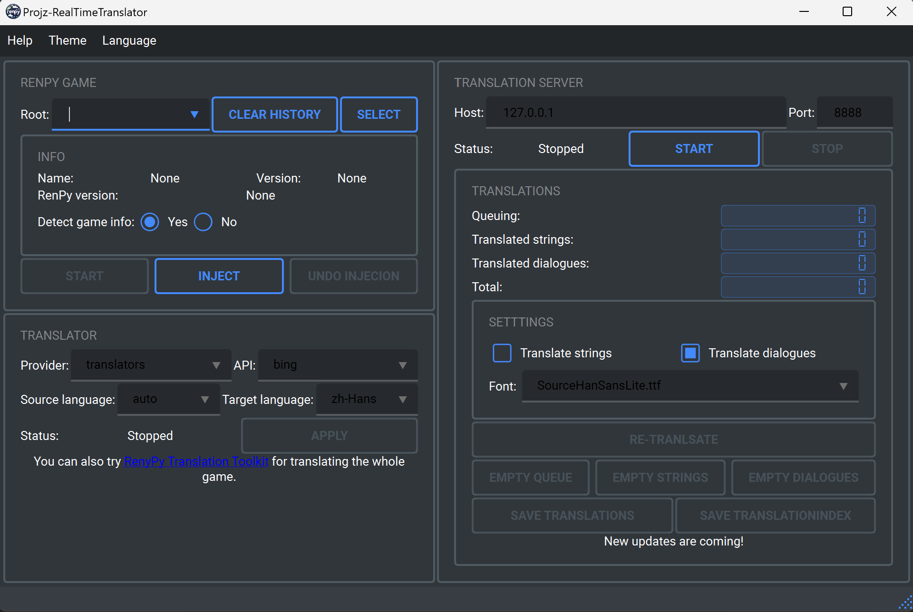

然后进行以下步骤来翻译RenPy游戏：

1. 点击"Select"按钮选择你的RenPy游戏路径：

   

2. 点击"Injection"按钮进行游戏检测和代码注入：

   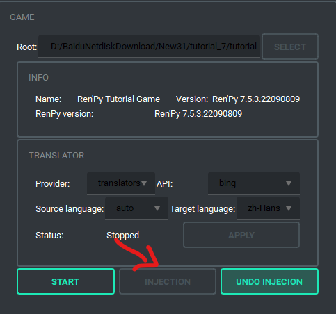

3. 在以下配置你需要的翻译器和显示的字体（注意，Provider=Foo用于测试功能，没有翻译功能）：

   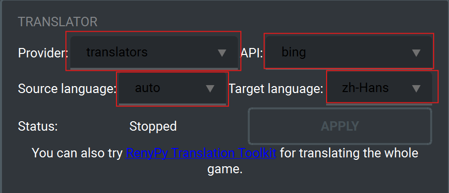

   

4. 点击"Start"按钮启动翻译服务器:

   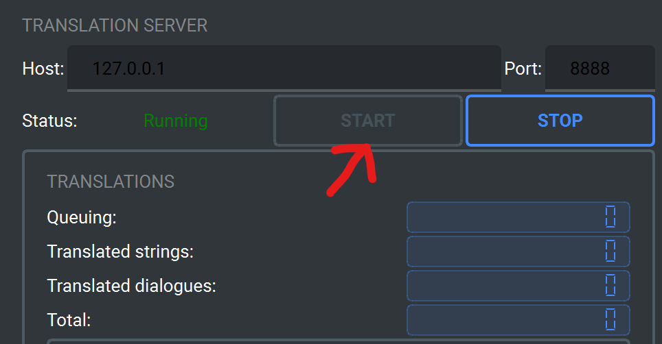

5. 点击GAME页面下的"Start"按钮启动游戏，或者手动启动游戏：

   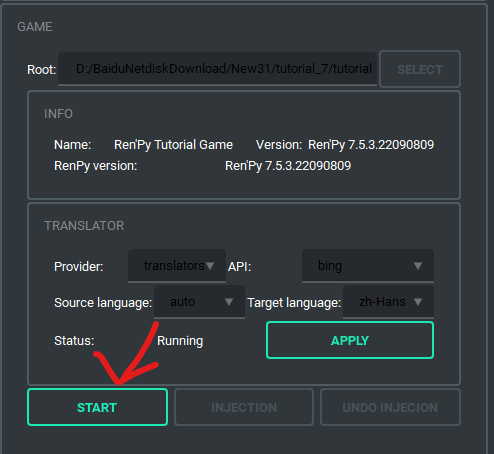

6. 在游戏运行过程中，你可能会感到卡顿，这是由于请求翻译造成的。

   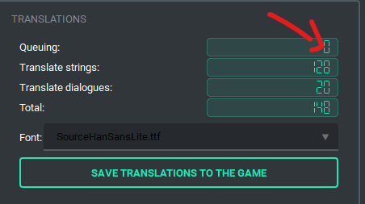

您还会发现第一次进入界面，并没有显示翻译结果。这是由于目前大量翻译文本排队中，因此你需要等待Queueing的数值归零，重新进入即可。

最后，你可以通过点击"Save translations"按钮保存当前的翻译结果到游戏中。这样即使你关闭该翻译器后，也能从翻译缓存中加载翻译。
这个翻译缓存文件`projz_translations.json`会保存到游戏根目录中。注意，请勿点击"Undo injection"按钮，这会使得我们翻译代码失效。

   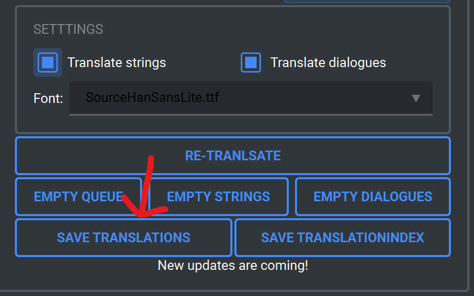

要使用翻译缓存文件您需要重新打开游戏，并关闭我们的翻译器。此外，我们的翻译器也会自动从游戏目录加载这个翻译缓存文件（在点击"Injection"按钮后），避免重复翻译。

你还可以通过点击"Save TranslationIndex"按钮保存当前的翻译保存为TranslationIndex，这样您可以在我们的命令行翻译工具中使用针对TranslationIndex各种命令来快速修改这些翻译。

## 在RealTime Translator中自定义您的翻译API
1. 在[translation_provider](translation_provider)中创建一个py文件。然后，创建一个类并继承[base.py](translation_provider/base.py)中的“Provider”类，实现以下方法(`reload_config()`并不是`Provider`类的成员函数，它主要用于再用户点击`重新加载配置文件`按钮后重新获取最新的配置值)：
```python
from trans import Translator
from typing import List, Tuple
from trans.translators_api import TranslatorsTranslator
from translation_provider.base import Provider, register_provider
import translators as ts

class TranslatorsApi(Provider):

    def __init__(self):
        super().__init__()
        self.trans_kwargs = None
        self.tconfig = None
        self.reload_config()

    def reload_config(self):
        self.tconfig = self.config['translator']['translators']
        self.trans_kwargs = self.tconfig.get('translate_text', {})

    def api_names(self) -> List[str]:
        return list(ts.translators_pool)

    def default_api(self) -> str:
        self.reload_config()
        return self.tconfig.get('api_name', 'bing')

    def default_source_lang(self) -> str:
        self.reload_config()
        return self.tconfig.get('from_language', 'auto')

    def default_target_lang(self) -> str:
        self.reload_config()
        return self.tconfig['to_language']

    def languages_of(self, api: str) -> Tuple[List[str], List[str]]:
        langs = sorted(list(ts.get_languages(api).keys()))
        return ['auto'] + langs, langs

    def translator_of(self, api: str, source_lang: str, target_lang: str) -> Translator:
        if api in self.api_names():
            s, t = self.languages_of(api)
            if source_lang in s and target_lang in t:
                return TranslatorsTranslator(api, source_lang, target_lang, self.trans_kwargs)
        return None

# 注册你的translation API
register_provider('translators', TranslatorsApi())
```
2. 在[\_\_init\_\_.py](translation_provider/__init__.py)中导入您的py文件：
```python
import logging
import translation_provider.base

# 您应该使用try-except块导入它
try:
    import translation_provider.translators
except Exception as e:
    logging.exception(e)
try:
    import translation_provider.closeapi
except Exception as e:
    logging.exception(e)
```
3. 运行: `python3 server_ui.py`

# 👀开始之前

注意，本命令行翻译工具并不是傻瓜式翻译工具，您需要一些步骤才能翻译整个游戏。本工具主要用于管理多个RenPy游戏的翻译项目和机器翻译文本，主要功能如下：
- 无需RenPy SDK即可导入和导出翻译
- 以项目为单位管理RenPy游戏各种语言翻译文本
- 使用免费翻译资源翻译文本
- 翻译文本中潜在错误检查，例如变量，样式标签，转义字符等,见：[新增功能 3](#新增功能)
- 提供I18n插件注入，为游戏提供语言和字体修改的插件
- 支持实现自定义的翻译接口，见[自定义翻译接口](#自定义翻译api)
- 翻译复用，导入翻译时可以使用预翻译好string文本，见[新增功能 4](#新增功能)
- 从其他翻译器（MTool、Translator++、XUnity Auto Translator）的生成文件导入翻译，见[新增功能 7](#新增功能)

本工具包含的全部命令:
```text
+--------------------+---------------------------------------------------------------------------+
|    Command name    |                                Description                                |
+--------------------+---------------------------------------------------------------------------+
|      new | n       |            Create a TranslationIndex from the given game path.            |
+--------------------+---------------------------------------------------------------------------+
|   new_file | nf    |          Create a FileTranslationIndex from the given file path.          |
+--------------------+---------------------------------------------------------------------------+
|     import | i     |   Import translations of the given language into this TranslationIndex.   |
|                    |                         (Base injection required)                         |
+--------------------+---------------------------------------------------------------------------+
|    generate | g    |  Generate translations of the given language from this TranslationIndex.  |
|                    |                         (Base injection required)                         |
+--------------------+---------------------------------------------------------------------------+
|     count | c      |        Print a count of missing translations of the given language.       |
|                    |                         (Base injection required)                         |
+--------------------+---------------------------------------------------------------------------+
|      open | o      | Open the location of the RenPy game associated with the TranslationIndex. |
|                    |                             (Windows OS Only)                             |
+--------------------+---------------------------------------------------------------------------+
|        lint        |                       Run lint for checking script.                       |
+--------------------+---------------------------------------------------------------------------+
|       launch       |        Launch the RenPy game associated with the TranslationIndex.        |
|                    |                             (Windows OS Only)                             |
+--------------------+---------------------------------------------------------------------------+
|    inject | ij     |               Inject our code or i18n plugins into the game.              |
+--------------------+---------------------------------------------------------------------------+
|   translate | t    |             Translate untranslated lines of the given language            |
|                    |                       using the specified translator.                     |
+--------------------+---------------------------------------------------------------------------+
| llm_translate | lt |             Translate untranslated lines of the given language            |
|                    |                     using the LLM Augment Translating.                    |
+--------------------+---------------------------------------------------------------------------+
|       ls | l       |                     List existing TranslationIndexes.                     |
+--------------------+---------------------------------------------------------------------------+
|        del         |                        Delete the TranslationIndex.                       |
+--------------------+---------------------------------------------------------------------------+
|       clear        |                    Clear all existing TranslationIndex.                   |
+--------------------+---------------------------------------------------------------------------+
|      discard       |                Discard translations of the given language.                |
+--------------------+---------------------------------------------------------------------------+
|       rename       |                  Rename a name of language translations.                  |
+--------------------+---------------------------------------------------------------------------+
|        copy        |                  Copy translations of the given language.                 |
+--------------------+---------------------------------------------------------------------------+
|        mark        |              Mark all untranslated lines as translated ones.              |
+--------------------+---------------------------------------------------------------------------+
|       unmark       |              Mark all translated lines as untranslated ones.              |
+--------------------+---------------------------------------------------------------------------+
|      upstats       |        Update translation stats of the specified TranslationIndex.        |
+--------------------+---------------------------------------------------------------------------+
|     merge | m      |  Merge translations of the given language from another TranslationIndex.  |
+--------------------+---------------------------------------------------------------------------+
|   savehtml | sh    |       Save untranslated lines of the given language to a html file.       |
+--------------------+---------------------------------------------------------------------------+
|   loadhtml | lh    |       Load translated lines of the given language from a html file.       |
+--------------------+---------------------------------------------------------------------------+
|   saveexcel | se   |       Save untranslated lines of the given language to a excel file.      |
+--------------------+---------------------------------------------------------------------------+
|   loadexcel | le   |       Load translated lines of the given language from a excel file.      |
+--------------------+---------------------------------------------------------------------------+
|   dumpexcel | de   |          Dump translations of the given language to a excel file.         |
+--------------------+---------------------------------------------------------------------------+
|      inspect       |         Inspect each translated line to find missing vars or tags,        |
|                    |        then save these error lines to a excel file. You can use the       |
|                    |       updateexcel command to update translations after you fix them.      |
+--------------------+---------------------------------------------------------------------------+
|  updateexcel | ue  |        Update translations of the given language from a excel file.       |
+--------------------+---------------------------------------------------------------------------+
|   savejson | sj    |       Save untranslated lines of the given language to a json file.       |
+--------------------+---------------------------------------------------------------------------+
|   loadjson | lj    |       Load translated lines of the given language from a json file.       |
+--------------------+---------------------------------------------------------------------------+
|      help | h      |                Print name and description of each command.                |
+--------------------+---------------------------------------------------------------------------+
|      quit | q      |                             Quit the program.                             |
+--------------------+---------------------------------------------------------------------------+
|      reconfig      |      Reload config from disk. It takes effect for most config items.      |
+--------------------+---------------------------------------------------------------------------+
|       about        |                                 About me.                                 |
+--------------------+---------------------------------------------------------------------------+
|        cls         |                               Clean screen.                               |
+--------------------+---------------------------------------------------------------------------+
```

本工具要求您熟悉一定RenPy翻译流程，通过合理利用此工具可以实现快速翻译，并节省大量资源和时间。

对于带有voice语句翻译也是支持的，不过程序默认行为只提取Say语句:`a "translated text"`。
```python
# game/script_21_1320.rpy:8
translate chinese scene_01_5f0ee2360:

    # voice "path/to/file"
    # a "text"
    voice "path/to/file"
    a "translated text"
```
对于上述翻译rpy，只会提取到`a "translated text"`。
如果想要提取`voice "path/to/file"`请设置[config.yaml](config.yaml)中的`index.say_only`为`False`。

# ✨针对Windows独立的EXE
现在您可使用打包好的exe运行此工具，免去按照Python环境，见：[Release](https://github.com/abse4411/projz_renpy_translation/releases)。要使用AI翻译仍需[安装Python环境](#1启动注意我们使用python38的环境)。

# 🛫快速开始

## 1.启动(可选)
> [!NOTE]  
> 你可以在[Release](https://github.com/abse4411/projz_renpy_translation/releases)下载exe，解压后直接运行，仅限Windows平台。

安装python3.8后，使用pip安装依赖：
```bash
pip install -r requirements_full.txt
```
安装完后，启动主程序：
```bash
python main.py
```

## 2.创建TranslationIndex

启动主程序后，控制台输入：
```bash
n D:\games\renpy_game_demo -n my_game
```
- `D:\games\renpy_game_demo` 是您的RenPy游戏根目录。
- `-n my_game`是可选的，您可以指定该TranslationIndex的别名，因此您可以使用别名代替序号，如果没有指定`-n`参数将会随机生成一个随机的别名。您还可以使用`-t 1.0`定义一个标签，这也是可选的，如果没有指定`-t`参数，默认的标签为`None`。
- `n`是`new`命令的缩写，我们为常用命令定义了命令缩写，您可以输入`help -u`命令打印所有命令的详细信息（包括它们的缩写）
> [!NOTE]  
> 如果RenPy游戏目录中含有空格，请用半角单双引号（或单引号）括起来，例如：new "D:\games\renpy game_demo" -n my_game

然后输入`ls`命令查看我们创建的TranslationIndex：

```bash
ls
```

输出类似：

```text
Note that: Translation Stats list translated/untranslated lines of dialogue and string for each language.
+-------+---------------+-------------------+------------------+-----------------------------------------------------+
| Index |  Nickname:tag | Translation Stats | Injection state  |                      Game info                      |
+-------+---------------+-------------------+------------------+-----------------------------------------------------+
|   1   |  my_game:None |                   |   Base   True    |       renpy_game_demo-V0.1, Ren'Py 7.4.11.2266      |
|       |               |                   |                  |                D:\games\renpy_game_demo             |
+-------+---------------+-------------------+------------------+-----------------------------------------------------+
```
注意`Injection state`中的`Base   True`，这表示我们成功识别并注入该游戏。

## 3.导入一个语言的翻译

> [!NOTE]  
> 在运行该命令前，请确保游戏中所有rpa文件被解压(使用[rpatool](https://github.com/Shizmob/rpatool)或
[UnRPA](https://github.com/Lattyware/unrpa))，rpyc转为rpy文件(
> 必须的，不然有些大部分rpy文件无法扫描，使用[unrpyc](https://github.com/CensoredUsername/unrpyc)工具)。
> 或者使用这个集成unrpa和unrypc的工具：[UnRen](https://github.com/VepsrP/UnRen-Gideon-mod-)。

### 解包你的RenPy游戏 (如果需要的话)

如果在你游戏的根目录的game的目录下有`.rpa`文件 (例如：`D:\games\renpy_game_demo\game`), 或者只有rpyc文件而没有对应同名的rpy文件，那你需要解包你的RenPy游戏。
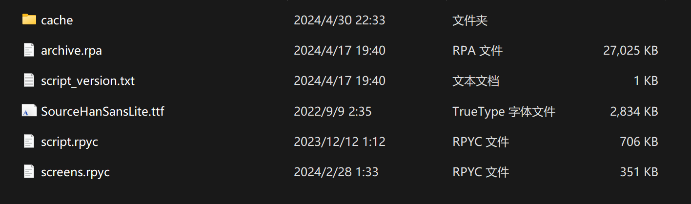

1. 从[UnRen Releases](https://github.com/VepsrP/UnRen-Gideon-mod-/releases)下载`UnRen-forall.bat`:
   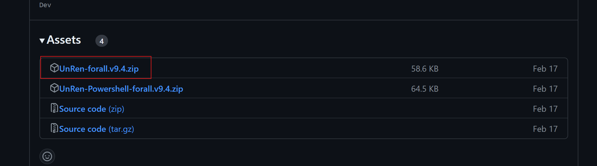
   解压，然后把里面的`UnRen-forall.bat`放在你的游戏根目录:
   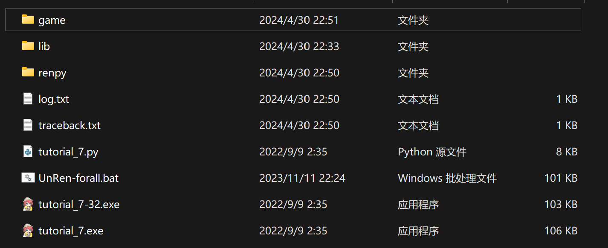
2. 运行它，然后输入: 回车, 8, 回车:
   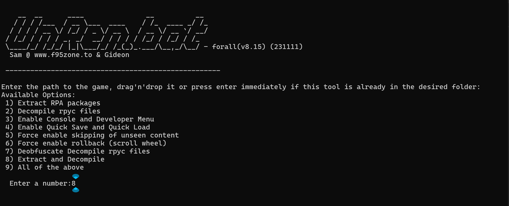
   然后输入: y:
   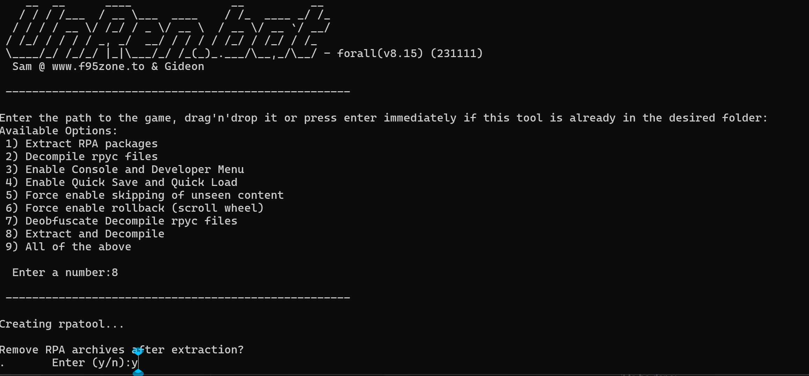
   等待操作完成，然后就可以关了:
   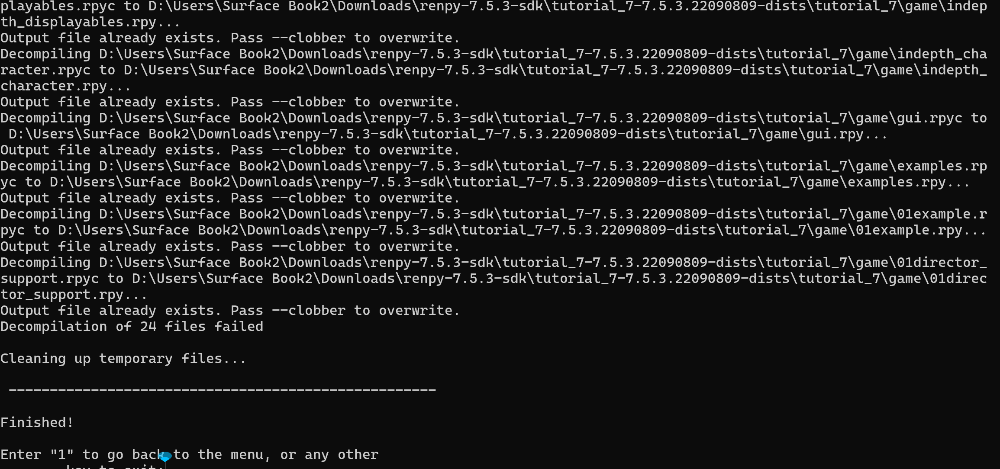

### 现在回到import命令

接着，控制台输入：

```bash
i my_game -l schinese
```

- `my_game` 指定要导入翻译的TranslationIndex的别名（Nickname），也可以用索引（Index）：`1`，也可以使用别名和标签的组合：`my_game:None`
- `-l schinese` 创建一个名为`schinese`的翻译，
- 这会读取`D:\games\renpy_game_demo\game\tl\schinese`的已经翻译和未翻译的文本

输入`ls`命令查看我们导入的翻译结果：

```bash
ls
```

输出类似：

```text
Note that: Translation Stats list translated/untranslated lines of dialogue and string for each language.
+-------+---------------+-----------------------------------------+------------------+-----------------------------------------------------+
| Index |  Nickname:tag |            Translation Stats            | Injection state  |                      Game info                      |
+-------+---------------+-----------------------------------------+------------------+-----------------------------------------------------+
|   1   |  my_game:None |   Language   Dialogue   String   Sum    |   Base   True    |       renpy_game_demo-V0.1, Ren'Py 7.4.11.2266      |
|       |               |   schinese    0/940     0/384    1324   |                  |                D:\games\renpy_game_demo             |
+-------+---------------+-----------------------------------------+------------------+-----------------------------------------------------+
```

## 3.使用翻译命令进行翻译

为方便这里使用`savehtml`和`loadhtml`命令进行快速翻译。其他翻译命令见：[Web翻译](#使用web翻译), [AI翻译](#使用AI翻译)，[使用saveexcel和loadexcel⚡快速⚡翻译](#使用saveexcel和loadexcel快速翻译), [使用uliontse-translators翻译](#使用uliontse-translators翻译)

现在我们用`savehtml`和`loadhtml`命令来翻译：

```bash
sh 1 -l schinese
```

输出类似：

```text
1320 untranslated lines are saved to ./projz\html\my_game_None_schinese.html.
```
如果您觉得保存到文件的翻译文本行数太多，可以指定`--limit {max_num}`参数来设置最大保存的行数。

然后使用Chrome或者Microsoft
Edge打开它，右键菜单翻译为指定语言后，Ctrl+S保存该html文件并覆盖原始的`my_game_None_schinese.html`。
这个详细步骤参考[使用savehtml和loadhtml⚡快速⚡翻译（浏览器自带网页翻译）](#使用savehtml和loadhtml快速翻译)

然后使用`loadhtml`命令导入翻译：

```bash
lh 1 -l schinese
```

输出类似：

```text
...
...
Find 1229 translated lines, and discord 91 lines
schinese: 854 updated dialogue translations, 375 updated string translations. [use:1229, discord:0, total:1229]
```

输入`ls`命令查看我们导入的翻译结果：

```text
Note that: Translation Stats list translated/untranslated lines of dialogue and string for each language.
+-------+---------------+-----------------------------------------+------------------+-----------------------------------------------------+
| Index |  Nickname:tag |            Translation Stats            | Injection state  |                      Game info                      |
+-------+---------------+-----------------------------------------+------------------+-----------------------------------------------------+
|   1   |  my_game:None |   Language   Dialogue   String   Sum    |   Base   True    |       renpy_game_demo-V0.1, Ren'Py 7.4.11.2266      |
|       |               |   schinese    856/84    377/7    1324   |                  |                D:\games\renpy_game_demo             |
+-------+---------------+-----------------------------------------+------------------+-----------------------------------------------------+
```

> **⏱支持翻译的命令速度最快的是？**<br />
> 一般来讲，翻译速度排名（从快到慢），依次是：
> 
> 1. saveexcel和loadexcel（半自动化）：使用Google Translate手动上传excel文件，并覆盖原始文件后导入
> 
> 2. savehtml和loadexcel（半自动化）：使用Microsoft Edge或Chrome的网页翻译功能（需要手动滚动网页），并覆盖原始文件后导入
> 
> 3. Uliontse/translators翻译（自动化）：`translate {index_or_name} -t ts -n bing -l {lang}`
> 
> 4. Web翻译（自动化）：`translate 1 -t web -n google -l {lang}` 利用自动化工具自动输入文本到翻译网站的输入框，并自动提取翻译结果
> 
> 5. AI翻译（自动化）: `translate 1 -t ai -n mbart50 -l {lang}` 利用深度网络模型翻译，需要消耗GPU资源
> 
> 各个翻译命令的翻译文本质量目前无法评估。

## 3.5 检查翻译结果

由于我们只是将原始文本发送给翻译器，因此翻译结果可能包含一些错误翻译内容，这些内容在运行游戏产生运行时错误。例如，以下原始文本：
```text
Today are [day].
```
翻译为（中文）后为：
```text
今天是[天]。
```
这里存在一个明显的错误，即变量`[day]`被错误地翻译为`[天]`. 因此，您将在运行游戏时收到一个KeyError。

翻译结果中还有一些其他类型的错误会在运行游戏时产生运行时错误：
```text
1. You can set it to a {size=30}fixed size{/size}.
 ->你可以将其设置为{大小=30}固定大小{/大小}。
Error: `{大小=30}` and `{/大小}` should be `{size=30}` and `{/size}`, respectively.

2. I have 100%% confidence.
 ->我有100%的信心。
Error: `100%` should be `100%%`.

...
```
要查找这些潜在的错误，我们可以使用`inspect`命令将这些错误导出到Excel文件:
```bash
inspect 1 -l schinese
```
然后，打开它，在`new_text`列中手动更正这些错误：
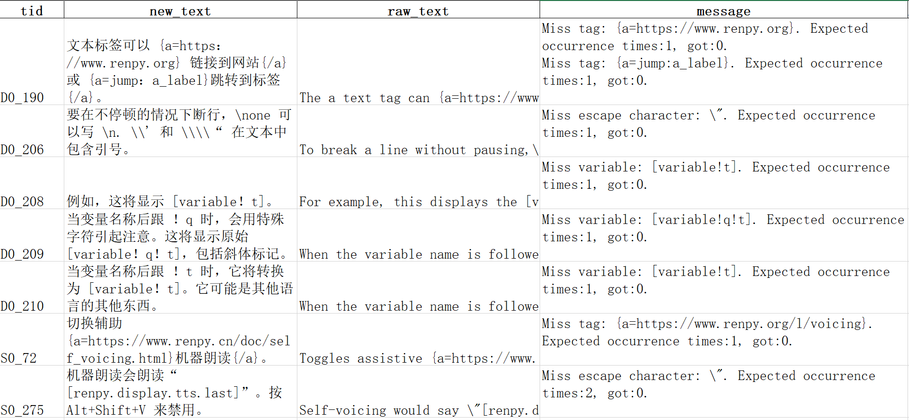
`message`列显示与`raw_text`相比，`new_text`中缺少的标签\变量\转义字符。
修复后，使用`updateexcel`命令更新翻译：
```bash
up 1 -l schinese
```

## 4.生成翻译rpy

然后使用`generate`命令来生成翻译rpy文件到游戏：

```bash
g 1 -l schinese
```

输出类似：

```text
...
...
schinese: dialogue translation: using 856 and missing 84, string translation: using 377 and missing 7
```

需要注意的是，如果`game/tl/{lang}`已经有rpy文件，里面包含翻译文本不会被覆盖，一般`generate`只会添加rpy文件没有的
翻译文本(追加模式)。如果您在TranslationIndex项目中修改了rpy文件已经存在翻译，要把TranslationIndex最新翻译应用到rpy文件中，请添加`-f`参数，这将删除`game/tl/{lang}`所有rpy/rpyc文件。

## 5.注入我们的I18N插件

为了在更改语言后让文本正确显示，我们这里附带了三款字体（下载链接可以在`resources/fonts/readme.txt`找到）：
```text
projz_renpy-translator/
    |–– resources/
        |–– fonts
           –– DejaVuSans.ttf
           –– SourceHanSansLite.ttf
           –– Roboto-Light.ttf
           –– readme.txt
```
您也可以手动添加自定义的字体到`resources/fonts`目录下(请注意字体的版权问题)，然后在[config.yaml](config.yaml)添加字体路径，这样程序会将字体拷贝到游戏目录`game/projz_fonts`中，同时I18N界面也会显示这些添加的字体配置。

然后使用`inject`命令注入我们提供的I18N插件（支持修改语言和字体）：

```bash
ij 1 -t I18n
```

输入`ls`命令查看注入结果：

```text
Note that: Translation Stats list translated/untranslated lines of dialogue and string for each language.
+-------+---------------+-----------------------------------------+------------------+-----------------------------------------------------+
| Index |  Nickname:tag |            Translation Stats            | Injection state  |                      Game info                      |
+-------+---------------+-----------------------------------------+------------------+-----------------------------------------------------+
|   1   |  my_game:None |   Language   Dialogue   String   Sum    |   Base   True    |       renpy_game_demo-V0.1, Ren'Py 7.4.11.2266      |
|       |               |   schinese    856/84    377/7    1324   |   I18n   True    |                D:\games\renpy_game_demo             |
+-------+---------------+-----------------------------------------+------------------+-----------------------------------------------------+
```

您也可以手动启动游戏或者使用`launch`命令:`launch 1`，或者使用`open`命令打开游戏所在位置:`o 1`

打开游戏后使用Ctrl+i快捷键打开该I18N插件，或者在游戏的设置界面找到名为`I18n settings`的按钮
(按钮的注入需要在screens.rpy文件中添加I18N按钮代码，因此需要把screens.rpyc转为screens.rpy)：


> [!TIP]
> 您可以在[config.yaml](config.yaml)文件配置生成I18N插件语言设置和字体内容，`inject`命令
> 生成的语言取决于`game/tl`下的非`None`文件夹与[config.yaml](config.yaml)的`lang_map`配置的语言交集
> 
> 字体可以在[config.yaml](config.yaml)的`fonts`添加
> 
> 如果`game/tl/{lang}`目录下存在对字体的配置（例如style.rpy）,我们的字体设置将会被覆盖而无效，这些字体配置类似：
> ```text
> translate schinese python:
>     gui.system_font = gui.main_font = gui.text_font = gui.name_text_font = gui.interface_text_font = gui.button_text_font = gui.choice_button_text_font = "SourceHanSansLite.ttf"
> ```
> 如果存在以上配置，您将无法通过我们的插件修改字体。
> 
> 开发者模式（Developer Mode）和调试控制台（Debug Console）的配置更改后需要重新加载游戏才能生效。
> 调试控制台的快捷键（Shift+O）和重新加载游戏的快捷键（Shift+R）需要在开发者模式打开时（Developer Mode=True）才可用。

## 命令帮助

输入`help`命令，打印所有命令的描述和用法，要查看某个命令的所有参数，
请在该命令后面加入一个`-h`选项：

```bash
new -h
```

这将打印`new`命令的详细用法。

> **🍻最后🍻**<br />
> 我们欢迎您集成您的翻译实现到我们的项目中，或者帮助我们翻译文档页面。

## 其他说明
1. 在修改配置文件[config.yaml](config.yaml)后，可以使用`reconfig`命令来重新加载配置文件。这适用与大多数配置项。
2. 如果您想导入和导出过程忽略某些rpy文件的翻译，请在[config.yaml](config.yaml)中设置`index.ignore`。注意，在window下目录分割符为`\`。假设您要屏蔽游戏`game`目录下的`script/demo.rpy`文件的翻译,这时添加的到`index.ignore`的文件路径应该是：`script\demo.rpy`。如果文件路径中含有空格，请保持原样即可，无需处理。
3. 在[config.yaml](config.yaml)中把`translator.ai.model_path`设置为空，则会自动下载模型到本地。
4. 您可以使用`de {index_or_name} -l {lang}`和`ue {index_or_name} -l {lang}`将指定TranslationIndex的数据（包括翻译和未翻译文本）分别导出到excel和从excel导入，这样您就可以修改已经翻译过的文本或者手动翻译某些文本。
5. 如果您想在翻译前去除文本的样式标签（如{font}），请在[config.yaml](config.yaml)中把`index.strip_tag`设置为`True`。
6. 如果您发现导出未翻译文本都是不需要翻译的，可以使用`mark`命令将这些文本变为已翻译文本：`mark {index_or_name} -l {lang}`。
7. 如果您想重命名一个语言的翻译（即{lang}名字），可以使用`rename`命令：`rename {index_or_name} -l {lang} -t {new_lang}`，其中`{new_lang}`为新的名称。
8. 要把其他TranslationIndex的翻译合并到当前的TranslationIndex，可以用`merge`命令： `merge {index_or_name} -l {lang} -s {source_index}`， 其中`{source_index}`是要合并翻译源的TranslationIndex。这样您可以在某个游戏更新后，复用旧版本的翻译到新版本中。

---
## 使用`saveexcel`和`loadexcel`⚡快速⚡翻译
使用`saveexcel`和`loadexcel`命令，导出未翻译文本为excel文件，然后借助Google翻译上传excel文件进行翻译，翻译完成覆盖原始excel文件，来实现快速的翻译。
  
### 使用步骤：
1. 使用`se {index_or_name} -l {lang}`命令，导出未翻译文本为excel文件，然后然后打开Google翻译（任何支持excel文档翻译的网站）使用文档翻译功能，上传该excel文件：
2. 等待翻译完成，下载翻译好的excel并覆盖原始的excel文件：

    

3. 使用`le {index_or_name} -l {lang}`命令，把翻译过的excel文件导入TranslationIndex。

> **😕翻译网站不支持文件excel文件？**<br />
> 您可以把excel文件内容粘贴到doc文件中，再上传doc文件进行翻译。当翻译完成后，把doc文件内翻译的内容重新覆盖原始excel文件即可。
---

## 使用`savehtml`和`loadhtml`⚡快速⚡翻译
使用`savehtml`和`loadhtml`命令，导出未翻译文本为html文件，然后借助Microsoft Edge或Chrome浏览器自带的翻译网页功能，并保存覆盖原始html文件，来实现快速的翻译。
  
### 使用步骤：
1. 使用`sh {index_or_name} -l {lang}`命令，导出未翻译文本为html文件，然后Microsoft Edge或Chrome打开它。
2. 在网页种右键，使用翻译网页功能，或者在地址栏右边找到翻译网页按钮：

    
    

3. 滚动网页让所有文本都翻译完毕， 然后`Ctrl + S` 保存文件，并覆盖原始的html文件。
4. 使用`lh {index_or_name} -l {lang}`命令，把翻译过的html文件导入TranslationIndex。
---
## 使用Web翻译
### 安装Chrome driver
下载并安装[Chrome浏览器](https://www.google.com/chrome/)。安装完成后，进入：设置->关于Chrome，找到您的Chrome版本，前往以下链接下载对应的chrome driver：
* [Chrome版本116.x.xxxx.xxx以下](https://registry.npmmirror.com/binary.html?path=chromedriver/) 
* [Chrome版本116.x.xxxx.xxx或更高🆕](https://googlechromelabs.github.io/chrome-for-testing/#stable)

下载针对含有"win"字样的chrome driver(win64/win32取决于您的Windows系统处理器架构，一般是win64），并解压到自定义目录下。 

在[config.yaml](config.yaml)中的`translator.web.chrome_driver_path`配置您的`chrome driver`文件路径：
```text
projz:
  translator:
    web:
      chrome_driver_path: 'D:\Users\Surface Book2\Downloads\chromedriver_win32\chromedriver.exe'
```
  
### 开始使用
1. 输入`t {index_or_name} -t web -n google -l {lang}`命令
2. 等待浏览器启动完成并显示网页后，手动设置您的翻译目标：
3. 等待控制台出现输入提示后，在输入`Y`或`y`在进行下一步操作（输入其他则退出），程序开始自动翻译。
---
## 使用AI翻译
  
### 安装符合条件的pytorch（可选）
如果您想使用CPU进行AI翻译可以跳过此步骤，否则按以下步骤来安装GPU（英伟达显卡，显存建议大于4GB）支持pytorch环境：
1. 打开命令提示符，使用以下命令查看您的CUDA版本：
    ```bash
    nvidia-smi
    ```
    一般它将输出如下信息：
    ```text
    +-----------------------------------------------------------------------------+
    | NVIDIA-SMI 517.48       Driver Version: 517.48       CUDA Version: 11.7     |
    |-------------------------------+----------------------+----------------------+
    | GPU  Name            TCC/WDDM | Bus-Id        Disp.A | Volatile Uncorr. ECC |
    | Fan  Temp  Perf  Pwr:Usage/Cap|         Memory-Usage | GPU-Util  Compute M. |
    |                               |                      |               MIG M. |
    |===============================+======================+======================|
    |   0  NVIDIA GeForce ... WDDM  | 00000000:02:00.0 Off |                  N/A |
    | N/A   33C    P0    21W /  N/A |      0MiB /  6144MiB |      1%      Default |
    |                               |                      |                  N/A |
    +-------------------------------+----------------------+----------------------+
    
    +-----------------------------------------------------------------------------+
    | Processes:                                                                  |
    |  GPU   GI   CI        PID   Type   Process name                  GPU Memory |
    |        ID   ID                                                   Usage      |
    |=============================================================================|
    |  No running processes found                                                 |
    +-----------------------------------------------------------------------------+
    ```
    我们可以看到现在的CUDA版本为: 11.7(如果您的CUDA版本也是11.7，且使用了`pip install -r requirements_full.txt`成功地安装我们的环境，那么可以跳过以下步骤，因为`requirements_full.txt`中的指定的pytorch版本就是它)
2. 为了确保安装指定版本的Pytorch，在安装新版本前使用以下命令卸载旧版本Pytorch和transformers库：
    ```bash
    pip uninstall torch torchaudio torchvision transformers
    ```
    然后接着前往[Pytorch官网](https://pytorch.org)找到对应CUDA的Pytorch版本，打开控制台按照指令安装。如果没有发现相关的CUDA版本可以在[此链接](https://pytorch.org/get-started/previous-versions/)找到旧的CUDA支持的Pytorch版本。例如，以下是我找到关于CUDA11.7的Pytorch安装信息：
      ```bash
    # For Linux and Windows
    # ROCM 5.4.2 (Linux only)
    pip install torch==2.0.1+rocm5.4.2 torchvision==0.15.2+rocm5.4.2 torchaudio==2.0.2 --index-url https://download.pytorch.org/whl/rocm5.4.2
    # CUDA 11.7
    pip install torch==2.0.1+cu117 torchvision==0.15.2+cu117 torchaudio==2.0.2 --index-url https://download.pytorch.org/whl/cu117
    # CUDA 11.8
    pip install torch==2.0.1+cu118 torchvision==0.15.2+cu118 torchaudio==2.0.2 --index-url https://download.pytorch.org/whl/cu118
    # CPU only
    pip install torch==2.0.1+cpu torchvision==0.15.2+cpu torchaudio==2.0.2 --index-url https://download.pytorch.org/whl/cpu
    ```
3. 完成上一步后，重新安装合适的transformers库：
    ```bash
    pip install transformers
    ```
  
### 准备模型(可选)
如果您的电脑可以正常访问[huggingface](https://huggingface.co/),说明模型可以正常下载，这时您可以把[config.yaml](config.yaml)中的`translator.web.chrome_driver_path`设置为空：
```yaml
projz:
  translator:
    ai:
      model_path: ''
```
这样transformer库可以自动决定模型下载位置，然后跳到`开始使用`步骤即可。

如果您访问不了该网站，或在使用时遇到下面的问题：

或者想指定模型保存的位置（一般模型大小2GB以上），请按以下步骤进行：
1. 假设您的保存模型目录为：`'D:\Download\New36\save_models'`，可用模型下载地址如下：
   - m2m100：https://huggingface.co/facebook/m2m100_418M/tree/main
   - mbart50：https://huggingface.co/facebook/mbart-large-50-many-to-many-mmt/tree/main
   - nllb200：https://huggingface.co/facebook/nllb-200-distilled-600M/tree/main

2. 选择一个模型，在模型目录`D:\Download\New36\save_models`下建立一个和模型同名目录，如`m2m100`，`mbart50`，`nllb200`，然后把所有文件(除了`rust_model.ot`)下载到对应模型目录下，例如：`D:\Download\New36\save_models\m2m100`：

    

3. 等文件都下载完后在[config.yaml](config.yaml)中设置模型的下载目录：
    ```yaml
    projz:
      translator:
        ai:
          model_path: 'D:\Download\New36\save_models'
    ```
### 开始使用
1. 输入以下命令：
    ```bash
   t {index_or_name} -t ai -n {model_name} -l {lang} -b 4
   ```
    - `-n`指定使用的模型，可选的模型有：`m2m100`，`mbart50`，`nllb200`，这里我们选择`m2m100`。
    - `-b`可以指定模型的batch size，其表示模型的一次翻译迭代中的文本数量，越大的batch size消耗越多的显存，因此可以根据您的显存大小决定。
2. 设置翻译目标，例如您想从英语(English)翻译到中文(Chinese)，分别输入英语和中文对应索引号就行，例如：`19 109`
    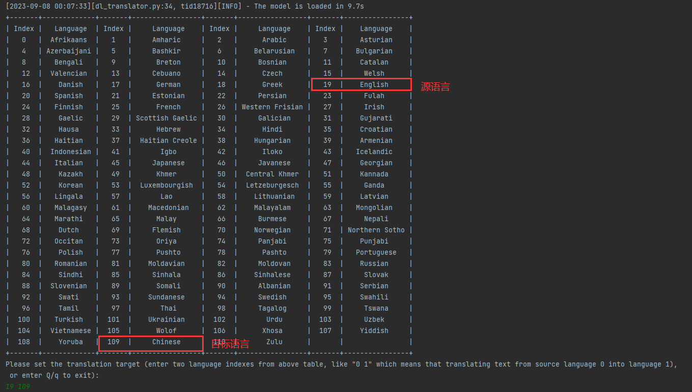
3. 完成以上步骤，程序会开始自动翻译。
---
## 使用UlionTse-translators翻译
### 开始使用
1. 输入以下命令：
    ```bash
   t {index_or_name} -t ts -n {API_name} -l {lang}
   ```
    - `-n`指定使用的API服务，可以使用`t -t ts -h`查看所有选的API服务, 默认为`bing` 。
2. 设置翻译目标,这和AI翻译第二步类似。
3. 完成以上步骤，程序会开始自动翻译。

注意,有关于该命令调用的`translate_text`和`preaccelerate`方法参数可以在[config.yaml](config.yaml)中的`translator.translators`分别配置。详情见: [UlionTse/translators](https://github.com/UlionTse/translators?tab=readme-ov-file#getting-started)

---

## 使用OpenAI Endpoint翻译

### 在[config.yaml](config.yaml)配置你的OpenAI Endpoint:
您可以配置`chat.completions.model`、`init.api_key`和`init.base_url`。
Prompt中的`｛target_lang｝`是要翻译成的语言，这是在运行时确定的。
Prompt中的`｛text｝`是翻译时要翻译的文本。
```yaml
open_ai:
  target_lang: 'Chinese'
  user_role: &user_role 'user'
  max_turns: 8 # Specify the maximum number of rounds for the conversation.
  langs: [...]
  models: [...]
  # Template Args
  # Args for initializing OpenAI() client
  init:
    base_url: http://localhost:11434/v1/
    api_key: 'ollama'
  chat:
    # Your client should have an endpoint whose url ends with "chat/completions". E.g., http://localhost:11434/v1/chat/completions
    # Args for client.chat.completions.create(), see https://platform.openai.com/docs/api-reference/chat/create
    completions:
      # temperature: 0.2
      # top_p: 0.1
      stream: false
      model: "qwen:0.5b"
      messages:
        -
          role: "system"
          content: "You are a professional translator. You are now required to translate the text given by the user into {target_lang} based on the context of the chat. Content enclosed in square brackets (For example, [lisa_alias], [day]) does not need to be translated. NO EXPLANATION is needed for the translation result."
          # content: "你是一个专业的翻译家。现在要求你根据聊天上下文信息把用户给定的文本翻译为{target_lang}。以方括号括起来的内容(例如: [lisa_alias], [day])不需要翻译。不需要对翻译结果做任何解释。"
        -
          role: *user_role
          content: "{text}"
```
### 开始使用
#### 针对命令翻译工具
```bash
t {index_or_name} -t openai -l {lang}
```
> [!TIP]
> 这里我们强烈建议您使用使用`llm_translate`命令代替以上翻译命令。如要使用`llm_translate`命令：
> `lt {index or name} -l {lang} -m qwen:0.5b -t Chinese`或者
> `lt {index or name} -l {lang} -a`

#### 针对实时翻译
在UI界面的provider列表选择"CloseAI"。

# 💪自定义翻译API
如果想要实现自己的翻译API非常简单，在[translator](translator)文件夹下新建一个py文件，然后继承`CachedTranslatorTemplate`类或者`TranslatorTemplate`类（`CachedTranslatorTemplate`类实现了翻译缓存机制，当翻译文本达到一定数量后就写入到TranslationIndex，可在[config.yaml](config.yaml)中配置`translator.write_cache_size`来决定翻译写入缓存大小，而`TranslatorTemplate`类则一次性给出所有未翻译文本，并调用`translate_batch`方法）：

```python
from argparse import ArgumentParser
from translator.base import CachedTranslatorTemplate
from command.translation.base import register_cmd_translator
from typing import List, Tuple
from config.base import ProjzConfig


# 翻译API调用流程，以DlTranslator为例：
# 1.用户输入:translate 1 -l chinese -t ai --name mbart50
# 2.创建DlTranslator实例，并调用register_args方法（注意DlTranslator必须使用无参数的构造函数）
# 3.如果用户输入的参数含有'-h'或'--help'，则打印DlTranslator的命令帮助，然后跳转到7.结束。
# 4.调用do_init方法(在这里开始翻译API的初始化应该在这里开始，这里可以使用转换好的args和config),
#   如果do_init()返回False，则跳转到7.结束
# 5.调用invoke方法(基类CachedTranslatorTemplate或者TranslatorTemplate已经实现，DlTranslator无需实现)
# 6.invoke方法默认实现调用translate_batch方法，而translate_batch循环调用translate方法
# 7.结束

class DlTranslator(CachedTranslatorTemplate):
   def register_args(self, parser: ArgumentParser):
      super().register_args(parser)
      # 这里注册您要接受的命令行参数
      # 注意：在这里请不要做任何初始化工作，因为很可能用户只是想知道该翻译API有哪些参数。
      # 初始化工作请放在do_init方法
      parser.add_argument('-n', '--name', choices=['m2m100', 'mbart50', 'nllb200'], default='mbart50',
                          help='The name of deep learning translation  model.')

   def do_init(self, args, config: ProjzConfig):
      super().do_init(args, config)
      # 当用户决定使用这个翻译API时会调用这个方法
      # 请在这里做初始化工作，您现在可以使用已经转换好的args和config
      self._model_name = args.name
      self._model_path = config['translator']['ai']['model_path']
      self._load_model()
      return True # 如果初始话没问题，返回True

   def translate(self, text: str):
      # 您的API翻译方法，接受一个字符串返回一个翻译的字符串
      return self.mt.translate(text, self._source, self._source, batch_size=1, verbose=True)

   def translate_batch(self, texts: List[str]):
      # 如果您的API支持批量翻译，您可以实现该方法。注意返回翻译结果的list长度应该和传入texts的长度一致。
      # 如果没有实现该方法，基类实现默认会循环调用translate方法。
      # CachedTranslatorTemplate每调用一次translate_batch后，就把翻译后的文本写入到TranslationIndex
      # texts数组最大长度取决于config.yaml中的translator.write_cache_size配置的大小
      return self.mt.translate(texts, self._source, self._source, batch_size=self._batch_size, verbose=True)


# 将您的翻译API注册到translate命令
# 用户可以这样使用：translate 1 -l chinese -t ai --name mbart50
# 其中-t ai为register指定您的翻译API名称
# 注意：DlTranslator应该使用无参数的构造函数，一旦实现无参数的构造函数请记得调用基类构造函数
register_cmd_translator('ai', DlTranslator)
```
最后在[translator/__init __.py](translator/__init__.py)导入您的翻译API：
```python
import logging
import translator.base

try:
    import translator.web
except Exception as e:
    print(f'error: {e}')
    logging.exception(e)

try:
    # 您可使用try-except语句导入您的翻译API，这样做可以让用户即使没有安装相应的python库也能正常运行程序。
    # 否则，一旦用户没有安装需要的python库，将无法运行main.py
    import translator.ai
except Exception as e:
    print(f'error: {e}')
    logging.exception(e)
```
具体示例可以参考[translator/ai/impl.py](translator/ai/impl.py)中`DlTranslator`类的实现。

# 💖赞助
<div align="center">
<br />

<h3>

该项目在个人的业余时间开发。如果你想要支持这个项目，可以点亮star⭐，或者请我一杯蜜雪冰城：[](imgs/sponsor/weixin.png), [](https://www.paypal.com/paypalme/abse4411)

</h3>

</div>

## 😘感谢我的赞助者们：
- 799190761
- ansan

如果你发现你的名字在这个列表中遗漏了，请接受我的道歉，并给[我](mailto:1834674034@qq.com)发电子邮件以添加它。

# 🗒Todo List:

1. [x] 添加英语文档
2. [ ] GUI支持
3. [ ] 翻译时检查

# 🔗Acknowledgement

我们参考或调用代码：

* 早期项目代码（Web翻译）参考：[Maooookai(Mirage)](https://github.com/Maooookai/WebTranslator), [DrDRR](https://github.com/drdrr/RenPy-WebTranslator)
* 使用的AI翻译库：[dl-translate](https://github.com/xhluca/dl-translate), [MIT License](https://github.com/xhluca/dl-translate?tab=MIT-1-ov-file)
* [UlionTse/translators](https://github.com/UlionTse/translators), [GPL-3.0 License](https://github.com/UlionTse/translators?tab=GPL-3.0-1-ov-file)
* 预翻译RPY文件来源：[RenPy](https://github.com/renpy/renpy/tree/master/launcher/game/tl), [MIT License for these rpy files](https://www.renpy.org/doc/html/license.html)
* [resources/codes/projz_injection.py](resources/codes/projz_injection.py): [RenPy](https://github.com/renpy/renpy/blob/master/renpy/translation/generation.py), [MIT License for the code file](https://www.renpy.org/doc/html/license.html)
* UI: PyQt5, 包含两个License: the GNU GPL v3 and the Riverbank Commercial License, 见[这里](https://www.riverbankcomputing.com/software/pyqt/).
* UI 主题: Qt-Material, [BSD-2-Clause license](https://github.com/UN-GCPDS/qt-material?tab=BSD-2-Clause-1-ov-file)
* 其他使用的python库见：[requirements_full.txt](./requirements_full.txt)

# Star History

<a href="https://star-history.com/#abse4411/projz_renpy_translation&Date">
  <picture>
    <source media="(prefers-color-scheme: dark)" srcset="https://api.star-history.com/svg?repos=abse4411/projz_renpy_translation&type=Date&theme=dark" />
    <source media="(prefers-color-scheme: light)" srcset="https://api.star-history.com/svg?repos=abse4411/projz_renpy_translation&type=Date" />
    
  </picture>
</a>
