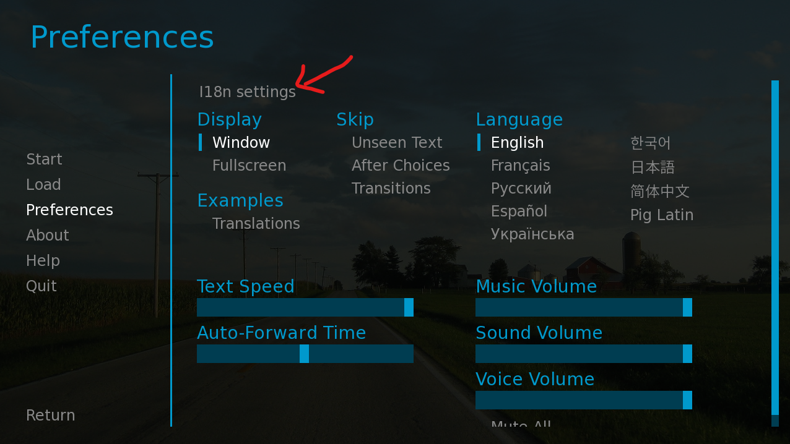
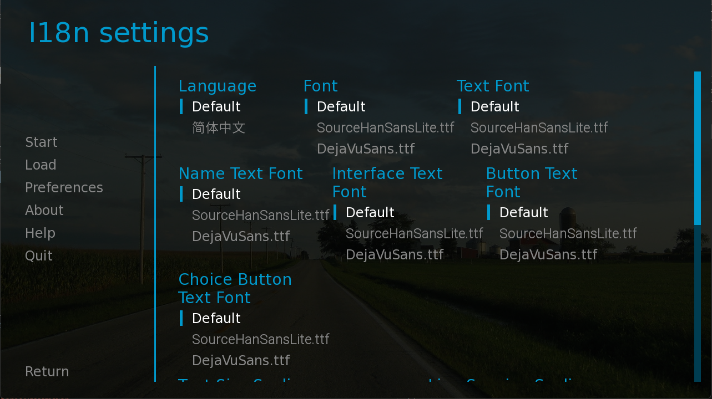
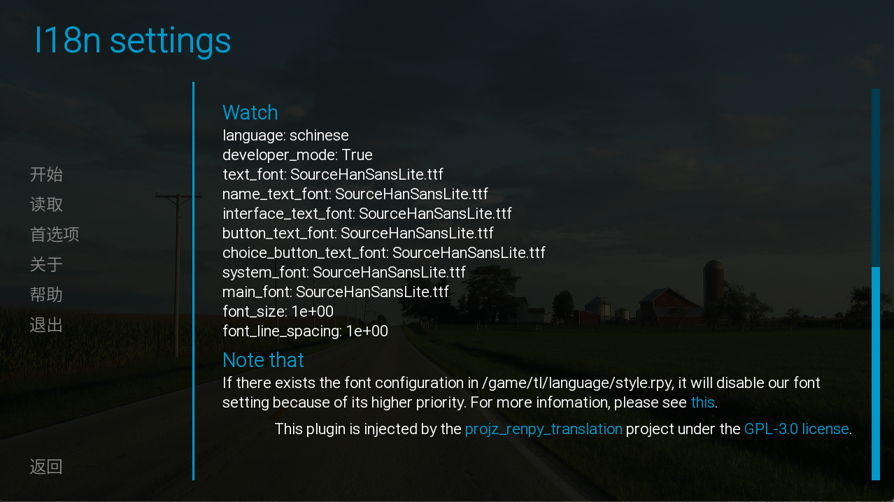
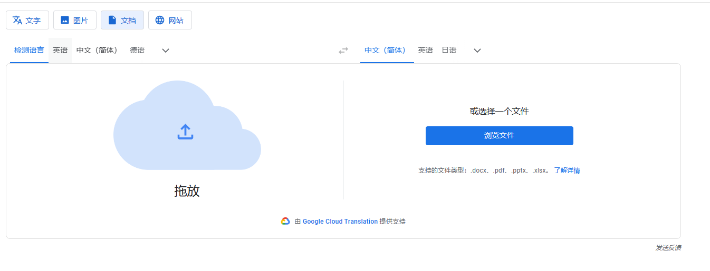
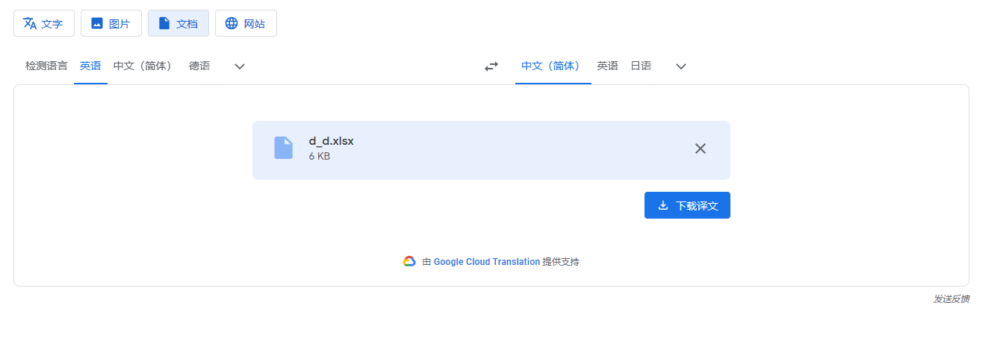
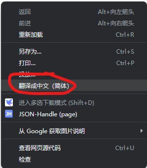
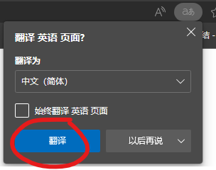
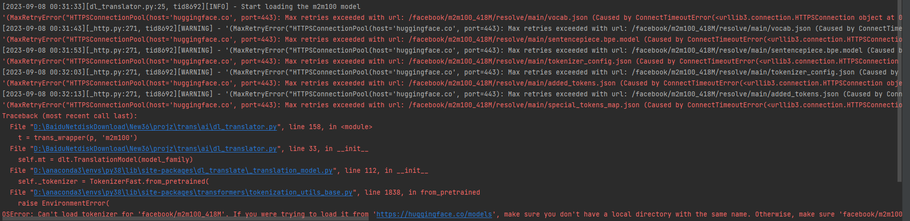
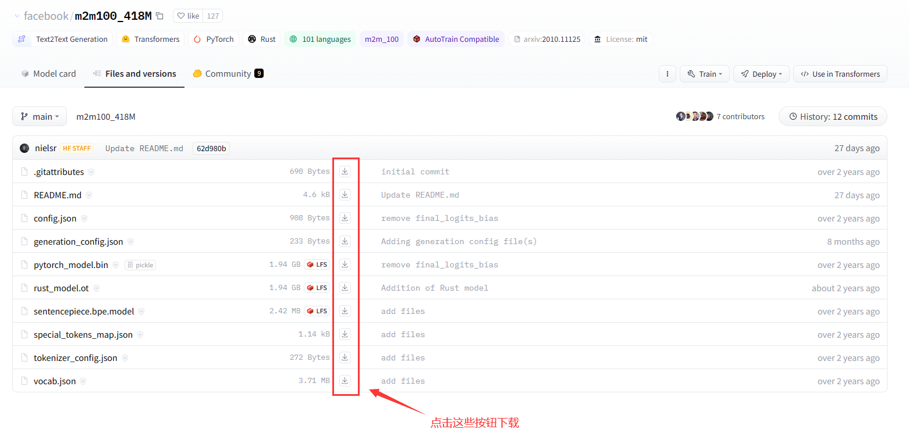

<div align="center">
  <h1>Projz - RenyPy Translation Toolkit</h1>
  
  <br />

[](https://github.com/abse4411/projz_renpy_translation)
[](https://github.com/abse4411/projz_renpy_translation/blob/devp/LICENSE)

[📘文档](#快速开始) |
[🛠安装](#1启动注意我们使用python38的环境) |
[💡建议](https://github.com/abse4411/projz_renpy_translation/issues)

简体中文 | [English](README.md)

</div>

# 👀开始之前

注意，本工具并不是傻瓜式翻译工具，本工具主要用于管理多个RenPy游戏的翻译项目和机器翻译文本，主要功能如下：
- 无需RenPy SDK即可导入和导出翻译
- 以项目为单位管理RenPy游戏各种语言翻译文本
- 使用免费翻译资源翻译文本
- 翻译文本中潜在错误检查，例如变量，样式标签，转义字符等,见：[新增功能 3](#新增功能)
- 提供I18n插件注入，为游戏提供语言和字体修改的插件
- 支持实现自定义的翻译接口，见[自定义翻译接口](#自定义翻译api)
- 翻译复用，导入翻译时可以使用预翻译好string文本，见[新增功能 4](#新增功能)

本工具要求您熟悉一定RenPy翻译流程，通过合理利用此工具可以实现快速翻译，并节省大量资源和时间。

对于带有voice语句翻译也是支持的，不过程序默认行为只提取Say语句:`a "translated text"`。
```python
# game/script_21_1320.rpy:8
translate chinese scene_01_5f0ee2360:

    # voice "path/to/file"
    # a "text"
    voice "path/to/file"
    a "translated text"
```
对于上述翻译rpy，只会提取到`a "translated text"`。
如果想要提取`voice "path/to/file"`请设置[config.yaml](config.yaml)中的`index.say_only`为`False`。

## 🚨注意🚨
- 现在正在开发中,该版本不兼容V0.4.0之前的数据，要使用旧版本请到[这里](https://github.com/abse4411/projz_renpy_translation/tree/9e257770e9b30011b1053da28634c41d958d0fc5)。
- 我们不提供任何RenPy游戏文件，该程序仅为方便开发人员管理翻译文件。任何因使用本程序产生的后果由使用者负责。

# ✨新增功能：

1. [Web翻译](#使用web翻译)，仅限google: `translate {index_or_name} -t web -n google -l {lang}`
2. [AI翻译](#使用AI翻译): `translate {index_or_name} -t ai -n mbart50 -l {lang}`
3. 翻译文本潜在错误检查:
  使用`inspect`命令检查已翻译文本中缺失的变量名(如\[var\])或者样式化标签(如{font})或者转义字符: `inspect {index_or_name} -l {lang}`。
  在生成的excel文件完成修复后，使用`updateexcel`命令导入修复的文本：`updateexcel {index_or_name} -l {lang}`
4. [0.4.1] String翻译复用: 您可以将某个语言`{lang}`已经翻译好的rpy文件在`resources/tl/{lang}`下。注意：仅支持像以下string类型翻译文本：
   ```text
   translate schinese strings:
   
       # renpy/common/00accessibility.rpy:28
       old "Self-voicing disabled."
       new "机器朗读已禁用。"
   
       # renpy/common/00accessibility.rpy:29
       old "Clipboard voicing enabled. "
       new "剪贴板朗读已启用。"
   ```
   此外，我们也预置许多语言的预翻译rpy文件（这些文件来源于[RenPy](https://github.com/renpy/renpy/tree/master/launcher/game/tl)）。当您使用`import`命令, 如：`i {projrct} -l {lang}`时，如果指定的lang参数与`resources/tl`目录下的某个目录名一致时，将自动复用`resources/tl/{lang}`中rpy存在的string翻译。如果您不想复用这些翻译，请在使用`import`命令后面添加`-nr`选项。

    需要注意的是，代码提供的rpy文件源语言是英语(English)，即提供英语其他语言的翻译文件。复用rpy文件的根目录可以通过[config.yaml](config.yaml)中的`index.recycle_dir`配置。
5. [0.4.1] 打开RenPy游戏、保存文件的所在位置（仅限Windows平台）：新命令`open`可以打开与TranslationIndex关联的游戏可执行文件所在位置：`o {peoject}`。一些保存文件的命令（如`savehtml`、`saveexcel`、`dumpexcel`等）在保存文件后会自动打开文件所在位置，如果要阻止这种行为请在相应命令后面添加`-nw`选项。

# 🛫快速开始

## 1.启动(注意我们使用Python3.8的环境)

安装python3.8后，使用pip安装依赖：
```bash
pip install -r requirements.txt
```
安装完后，启动主程序：
```bash
python main.py
```

## 2.创建TranslationIndex

> **🚨注意🚨**<br />
> 在运行该命令前，请确保游戏中所有rpa文件被解压(使用[rpatool](https://github.com/Shizmob/rpatool)或
[UnRPA](https://github.com/Lattyware/unrpa))，rpyc转为rpy文件(
> 必须的，不然有些大部分rpy文件无法扫描，使用[unrpyc](https://github.com/CensoredUsername/unrpyc)工具)。
> 或者使用这个集成unrpa和unrypc的工具：[UnRen](https://github.com/VepsrP/UnRen-Gideon-mod-)。

启动主程序后，控制台输入：
```bash
n D:\games\renpy_game_demo -n my_game
```
- `D:\games\renpy_game_demo` 是您的RenPy游戏根目录。
- `-n my_game`是可选的，您可以指定该TranslationIndex的别名，因此您可以使用别名代替序号，如果没有指定`-n`参数将会随机生成一个随机的别名。您还可以使用`-t 1.0`定义一个标签，这也是可选的，如果没有指定`-t`参数，默认的标签为`None`。
- `n`是`new`命令的缩写，我们为常用命令定义了命令缩写，您可以输入`help -u`命令打印所有命令的详细信息（包括它们的缩写）
> **🚨注意🚨**<br />
> 如果RenPy游戏目录中含有空格，请用半角单双引号（或单引号）括起来，例如：new "D:\games\renpy game_demo" -n my_game

然后输入`ls`命令查看我们创建的TranslationIndex：

```bash
ls
```

输出类似：

```text
Note that: Translation Stats list translated/untranslated lines of dialogue and string for each language.
+-------+---------------+-------------------+------------------+-----------------------------------------------------+
| Index |  Nickname:tag | Translation Stats | Injection state  |                      Game info                      |
+-------+---------------+-------------------+------------------+-----------------------------------------------------+
|   1   |  my_game:None |                   |   Base   True    |       renpy_game_demo-V0.1, Ren'Py 7.4.11.2266      |
|       |               |                   |                  |                D:\games\renpy_game_demo             |
+-------+---------------+-------------------+------------------+-----------------------------------------------------+
```
注意`Injection state`中的`Base   True`，这表示我们成功识别并注入该游戏。

## 3.导入一个语言的翻译

接着，控制台输入：

```bash
i my_game -l schinese
```

- `my_game` 指定要导入翻译的TranslationIndex的别名（Nickname），也可以用索引（Index）：`1`，也可以使用别名和标签的组合：`my_game:None`
- `-l schinese` 创建一个名为`schinese`的翻译，
- 这会读取`D:\games\renpy_game_demo\game\tl\schinese`的已经翻译和未翻译的文本

输入`ls`命令查看我们导入的翻译结果：

```bash
ls
```

输出类似：

```text
Note that: Translation Stats list translated/untranslated lines of dialogue and string for each language.
+-------+---------------+-----------------------------------------+------------------+-----------------------------------------------------+
| Index |  Nickname:tag |            Translation Stats            | Injection state  |                      Game info                      |
+-------+---------------+-----------------------------------------+------------------+-----------------------------------------------------+
|   1   |  my_game:None |   Language   Dialogue   String   Sum    |   Base   True    |       renpy_game_demo-V0.1, Ren'Py 7.4.11.2266      |
|       |               |   schinese    0/940     0/384    1324   |                  |                D:\games\renpy_game_demo             |
+-------+---------------+-----------------------------------------+------------------+-----------------------------------------------------+
```

## 3.使用翻译命令进行翻译

为方便这里使用`savehtml`和`loadhtml`命令进行快速翻译。其他翻译命令见：[Web翻译](#使用web翻译), [AI翻译](#使用AI翻译)，[使用saveexcel和loadexcel⚡快速⚡翻译](#使用saveexcel和loadexcel快速翻译)

现在我们用`savehtml`和`loadhtml`命令来翻译：

```bash
sh 1 -l schinese
```

输出类似：

```text
1320 untranslated lines are saved to ./projz\html\my_game_None_schinese.html.
```
如果您觉得保存到文件的翻译文本行数太多，可以指定`--limit {max_num}`参数来设置最大保存的行数。

然后使用Chrome或者Microsoft
Edge打开它，右键菜单翻译为指定语言后，Ctrl+S保存该html文件并覆盖原始的`my_game_None_schinese.html`。
这个详细步骤参考[使用savehtml和loadhtml⚡快速⚡翻译（浏览器自带网页翻译）](#使用savehtml和loadhtml快速翻译)

然后使用`loadhtml`命令导入翻译：

```bash
lh 1 -l schinese
```

输出类似：

```text
...
...
Find 1229 translated lines, and discord 91 lines
schinese: 854 updated dialogue translations, 375 updated string translations. [use:1229, discord:0, total:1229]
```

输入`ls`命令查看我们导入的翻译结果：

```text
Note that: Translation Stats list translated/untranslated lines of dialogue and string for each language.
+-------+---------------+-----------------------------------------+------------------+-----------------------------------------------------+
| Index |  Nickname:tag |            Translation Stats            | Injection state  |                      Game info                      |
+-------+---------------+-----------------------------------------+------------------+-----------------------------------------------------+
|   1   |  my_game:None |   Language   Dialogue   String   Sum    |   Base   True    |       renpy_game_demo-V0.1, Ren'Py 7.4.11.2266      |
|       |               |   schinese    856/84    377/7    1324   |                  |                D:\games\renpy_game_demo             |
+-------+---------------+-----------------------------------------+------------------+-----------------------------------------------------+
```

> **⏱支持翻译的命令速度最快的是？**<br />
> 一般来讲，翻译速度排名（从快到慢），依次是：
> 
> 1. saveexcel和loadexcel（半自动化）：使用Google Translate手动上传excel文件，并覆盖原始文件后导入
> 
> 2. savehtml和loadexcel（半自动化）：使用Microsoft Edge或Chrome的网页翻译功能（需要手动滚动网页），并覆盖原始文件后导入
> 
> 3.Web翻译（自动化）：`translate 1 -t web -n google -l {lang}` 利用自动化工具自动输入文本到翻译网站的输入框，并自动提取翻译结果
> 
> 4. AI翻译（自动化）: `translate 1 -t ai -n mbart50 -l {lang}` 利用深度网络模型翻译，需要消耗GPU资源
> 
> 各个翻译命令的翻译文本质量目前无法评估。

## 4.生成翻译rpy

然后使用`generate`命令来生成翻译rpy文件到游戏：

```bash
g 1 -l schinese
```

输出类似：

```text
...
...
schinese: dialogue translation: using 856 and missing 84, string translation: using 377 and missing 7
```

需要注意的是，如果`game/tl/{lang}`已经有rpy文件，里面包含翻译文本不会被覆盖，一般`generate`只会添加rpy文件没有的
翻译文本(追加模式)。如果您在TranslationIndex项目中修改了rpy文件已经存在翻译，要把TranslationIndex最新翻译应用
到rpy文件中，请添加`-f`参数，这将删除`game/tl/{lang}`所有rpy/rpyc文件。

## 5.注入我们的I18N插件

为了在更改语言后让文本正确显示，我们这里附带了三款字体（下载链接可以在`resources/fonts/readme.txt`找到）：
```text
projz_renpy-translator/
    |–– resources/
        |–– fonts
           –– DejaVuSans.ttf
           –– SourceHanSansLite.ttf
           –– Roboto-Light.ttf
           –– readme.txt
```
您也可以手动添加自定义的字体到`resources/fonts`目录下(请注意字体的版权问题)，然后在[config.yaml](config.yaml)添加字体路径，这样程序会将字体拷贝到游戏目录`game/projz_fonts`中，同时I18N界面也会显示这些添加的字体配置。

然后使用`inject`命令注入我们提供的I18N插件（支持修改语言和字体）：

```bash
ij 1 -t I18n
```

输入`ls`命令查看注入结果：

```text
Note that: Translation Stats list translated/untranslated lines of dialogue and string for each language.
+-------+---------------+-----------------------------------------+------------------+-----------------------------------------------------+
| Index |  Nickname:tag |            Translation Stats            | Injection state  |                      Game info                      |
+-------+---------------+-----------------------------------------+------------------+-----------------------------------------------------+
|   1   |  my_game:None |   Language   Dialogue   String   Sum    |   Base   True    |       renpy_game_demo-V0.1, Ren'Py 7.4.11.2266      |
|       |               |   schinese    856/84    377/7    1324   |   I18n   True    |                D:\games\renpy_game_demo             |
+-------+---------------+-----------------------------------------+------------------+-----------------------------------------------------+
```

您也可以手动启动游戏或者使用`launch`命令:`launch 1`，或者使用`open`命令打开游戏所在位置:`o 1`

打开游戏后使用Ctrl+i快捷键打开该I18N插件，或者在游戏的设置界面找到名为`I18n settings`的按钮
(按钮的注入需要在screens.rpy文件中添加I18N按钮代码，因此需要把screens.rpyc转为screens.rpy)：




> **💡额外内容💡**<br />
> 你可以在[config.yaml](config.yaml)文件配置生成I18N插件语言设置和字体内容，`inject`命令
> 生成的语言取决于`game/tl`下的非`None`文件夹与[config.yaml](config.yaml)的`lang_map`配置的语言交集
> 
> 字体可以在[config.yaml](config.yaml)的`fonts`添加
> 
> 如果`game/tl/{lang}`目录下存在对字体的配置（例如style.rpy）,我们的字体设置将会被覆盖而无效，这些字体配置类似：
```text
translate schinese python:
    gui.system_font = gui.main_font = gui.text_font = gui.name_text_font = gui.interface_text_font = gui.button_text_font = gui.choice_button_text_font = "SourceHanSansLite.ttf"
```
> 如果存在以上配置，您将无法通过我们的插件修改字体。
> 
> 开发者模式（Developer Mode）和调试控制台（Debug Console）的配置更改后需要重新加载游戏才能生效。
> 调试控制台的快捷键（Shift+O）和重新加载游戏的快捷键（Shift+R）需要在开发者模式打开时（Developer Mode=True）才可用。

## 命令帮助

输入`help`命令，打印所有命令的描述和用法，要查看某个命令的所有参数，
请在该命令后面加入一个`-h`选项：

```bash
new -h
```

这将打印`new`命令的详细用法。

> **🍻最后🍻**<br />
> 我们欢迎你集成您的翻译实现到我们的项目中，或者帮助我们翻译文档页面。

## 其他说明
1. 修改配置文件[config.yaml](config.yaml)的内容，需要重新启动程序才能生效
2. 如果你想导入和导出过程忽略某些rpy文件的翻译，请在[config.yaml](config.yaml)中设置`index.ignore`。注意，在window下目录分割符为`\`。假设您要屏蔽游戏`game`目录下的`script/demo.rpy`文件的翻译,这时添加的到`index.ignore`的文件路径应该是：`script\demo.rpy`。如果文件路径中含有空格，请保持原样即可，无需处理。
3. 在[config.yaml](config.yaml)中把`translator.ai.model_path`设置为空，则会自动下载模型到本地。
4. 您可以使用`de {index_or_name} -l {lang}`和`ue {index_or_name} -l {lang}`将指定TranslationIndex的数据（包括翻译和未翻译文本）分别导出到excel和从excel导入，这样您就可以修改已经翻译过的文本或者手动翻译某些文本。
5. 如果您想在翻译前去除文本的样式标签（如{font}），请在[config.yaml](config.yaml)中把`index.strip_tag`设置为`True`。
6. 如果您发现导出未翻译文本都是不需要翻译的，可以使用`mark`命令将这些文本变为已翻译文本：`mark {index_or_name} -l {lang}`
7. 如果您想重命名一个语言的翻译（即{lang}名字），可以使用`rename`命令：`rename {index_or_name} -l {lang} t {new_lang}`，其中`{new_lang}`新的名称

---
## 使用`saveexcel`和`loadexcel`⚡快速⚡翻译
使用`saveexcel`和`loadexcel`命令，导出未翻译文本为excel文件，然后借助Google翻译上传excel文件进行翻译，翻译完成覆盖原始excel文件，来实现快速的翻译。
  
### 使用步骤：
1. 使用`se {index_or_name} -l {lang}`命令，导出未翻译文本为excel文件，然后然后打开Google翻译（任何支持excel文档翻译的网站）使用文档翻译功能，上传该excel文件：
2. 等待翻译完成，下载翻译好的excel并覆盖原始的excel文件：

    

3. 使用`le {index_or_name} -l {lang}`命令，把翻译过的excel文件导入TranslationIndex。

> **😕翻译网站不支持文件excel文件？**<br />
> 您可以把excel文件内容粘贴到doc文件中，再上传doc文件进行翻译。当翻译完成后，把doc文件内翻译的内容重新覆盖原始excel文件即可。
---

## 使用`savehtml`和`loadhtml`⚡快速⚡翻译
使用`savehtml`和`loadhtml`命令，导出未翻译文本为html文件，然后借助Microsoft Edge或Chrome浏览器自带的翻译网页功能，并保存覆盖原始html文件，来实现快速的翻译。
  
### 使用步骤：
1. 使用`sh {index_or_name} -l {lang}`命令，导出未翻译文本为html文件，然后Microsoft Edge或Chrome打开它。
2. 在网页种右键，使用翻译网页功能，或者在地址栏右边找到翻译网页按钮：

    
    

3. 滚动网页让所有文本都翻译完毕， 然后`Ctrl + S` 保存文件，并覆盖原始的html文件。
4. 使用`lh {index_or_name} -l {lang}`命令，把翻译过的html文件导入TranslationIndex。
---
## 使用Web翻译
### 安装Chrome driver
下载并安装[Chrome浏览器](https://www.google.com/chrome/)。安装完成后，进入：设置->关于Chrome，找到您的Chrome版本，前往以下链接下载对应的chrome driver：
* [Chrome版本116.x.xxxx.xxx以下](https://registry.npmmirror.com/binary.html?path=chromedriver/) 
* [Chrome版本116.x.xxxx.xxx或更高🆕](https://googlechromelabs.github.io/chrome-for-testing/#stable)

下载针对含有"win"字样的chrome driver(win64/win32取决于您的Windows系统处理器架构，一般是win64），并解压到自定义目录下。 

在[config.yaml](config.yaml)中的`translator.web.chrome_driver_path`配置您的`chrome driver`文件路径：
```text
projz:
  translator:
    web:
      chrome_driver_path: 'D:\Users\Surface Book2\Downloads\chromedriver_win32\chromedriver.exe'
```
  
### 开始使用
1. 输入`t {index_or_name} -t web -n google -l {lang}`命令
2. 等待浏览器启动完成并显示网页后，手动设置您的翻译目标：
3. 等待控制台出现输入提示后，在输入`Y`或`y`在进行下一步操作（输入其他则退出），程序开始自动翻译。
---
## 使用AI翻译
  
### 安装符合条件的pytorch（可选）
如果您想使用CPU进行AI翻译可以跳过此步骤，否则按以下步骤来安装GPU（英伟达显卡，显存建议大于4GB）支持pytorch环境：
1. 打开命令提示符，使用以下命令查看您的CUDA版本：
    ```bash
    nvidia-smi
    ```
    一般它将输出如下信息：
    ```text
    +-----------------------------------------------------------------------------+
    | NVIDIA-SMI 517.48       Driver Version: 517.48       CUDA Version: 11.7     |
    |-------------------------------+----------------------+----------------------+
    | GPU  Name            TCC/WDDM | Bus-Id        Disp.A | Volatile Uncorr. ECC |
    | Fan  Temp  Perf  Pwr:Usage/Cap|         Memory-Usage | GPU-Util  Compute M. |
    |                               |                      |               MIG M. |
    |===============================+======================+======================|
    |   0  NVIDIA GeForce ... WDDM  | 00000000:02:00.0 Off |                  N/A |
    | N/A   33C    P0    21W /  N/A |      0MiB /  6144MiB |      1%      Default |
    |                               |                      |                  N/A |
    +-------------------------------+----------------------+----------------------+
    
    +-----------------------------------------------------------------------------+
    | Processes:                                                                  |
    |  GPU   GI   CI        PID   Type   Process name                  GPU Memory |
    |        ID   ID                                                   Usage      |
    |=============================================================================|
    |  No running processes found                                                 |
    +-----------------------------------------------------------------------------+
    ```
    我们可以看到现在的CUDA版本为: 11.7(如果您的CUDA版本也是11.7，且使用了`pip install -r requirements.txt`成功地安装我们的环境，那么可以跳过以下步骤，因为`requirements.txt`中的指定的pytorch版本就是它)
2. 为了确保安装指定版本的Pytorch，在安装新版本前使用以下命令卸载旧版本Pytorch和transformers库：
    ```bash
    pip uninstall torch torchaudio torchvision transformers
    ```
    然后接着前往[Pytorch官网](https://pytorch.org)找到对应CUDA的Pytorch版本，打开控制台按照指令安装。如果没有发现相关的CUDA版本可以在[此链接](https://pytorch.org/get-started/previous-versions/)找到旧的CUDA支持的Pytorch版本。例如，以下是我找到关于CUDA11.7的Pytorch安装信息：
      ```bash
    # For Linux and Windows
    # ROCM 5.4.2 (Linux only)
    pip install torch==2.0.1+rocm5.4.2 torchvision==0.15.2+rocm5.4.2 torchaudio==2.0.2 --index-url https://download.pytorch.org/whl/rocm5.4.2
    # CUDA 11.7
    pip install torch==2.0.1+cu117 torchvision==0.15.2+cu117 torchaudio==2.0.2 --index-url https://download.pytorch.org/whl/cu117
    # CUDA 11.8
    pip install torch==2.0.1+cu118 torchvision==0.15.2+cu118 torchaudio==2.0.2 --index-url https://download.pytorch.org/whl/cu118
    # CPU only
    pip install torch==2.0.1+cpu torchvision==0.15.2+cpu torchaudio==2.0.2 --index-url https://download.pytorch.org/whl/cpu
    ```
3. 完成上一步后，重新安装合适的transformers库：
    ```bash
    pip install transformers
    ```
  
### 准备模型(可选)
如果您的电脑可以正常访问[huggingface](https://huggingface.co/),说明模型可以正常下载，这时您可以把[config.yaml](config.yaml)中的`translator.web.chrome_driver_path`设置为空：
```yaml
projz:
  translator:
    ai:
      model_path: ''
```
这样transformer库可以自动决定模型下载位置，然后跳到`开始使用`步骤即可。

如果您访问不了该网站，或在使用时遇到下面的问题：

或者想指定模型保存的位置（一般模型大小2GB以上），请按以下步骤进行：
1. 假设您的保存模型目录为：`'D:\Download\New36\save_models'`，可用模型下载地址如下：
   - m2m100：https://huggingface.co/facebook/m2m100_418M/tree/main
   - mbart50：https://huggingface.co/facebook/mbart-large-50-many-to-many-mmt/tree/main
   - nllb200：https://huggingface.co/facebook/nllb-200-distilled-600M/tree/main

2. 选择一个模型，在模型目录`D:\Download\New36\save_models`下建立一个和模型同名目录，如`m2m100`，`mbart50`，`nllb200`，然后把所有文件(除了`rust_model.ot`)下载到对应模型目录下，例如：`D:\Download\New36\save_models\m2m100`：

    

3. 等文件都下载完后在[config.yaml](config.yaml)中设置模型的下载目录：
    ```yaml
    projz:
      translator:
        ai:
          model_path: 'D:\Download\New36\save_models'
    ```
### 开始使用
1. 输入以下命令：
    ```bash
   t {index_or_name} -t ai -n {model_name} -l {lang} -b 4
   ```
    - `-n`指定使用的模型，可选的模型有：`m2m100`，`mbart50`，`nllb200`，这里我们选择`m2m100`。
    - `-b`可以指定模型的batch size，其表示模型的一次翻译迭代中的文本数量，越大的batch size消耗越多的显存，因此可以根据您的显存大小决定。
2. 设置翻译目标，例如您想从英语(English)翻译到中文(Chinese)，分别输入英语和中文对应索引号就行，例如：`19 109`
    
3. 完成以上步骤，程序会开始自动翻译。
---

# 💪自定义翻译API
如果想要实现自己的翻译API非常简单，在[translator](translator)文件夹下新建一个py文件，然后继承`CachedTranslatorTemplate`类或者`TranslatorTemplate`类（`CachedTranslatorTemplate`类实现了翻译缓存机制，当翻译文本达到一定数量后就写入到TranslationIndex，可在[config.yaml](config.yaml)中配置`translator.write_cache_size`来决定翻译写入缓存大小，而`TranslatorTemplate`类则一次性给出所有未翻译文本，并调用`translate_batch`方法）：
```python
from argparse import ArgumentParser
from translator.base import CachedTranslatorTemplate
from command.translation.base import register
from typing import List, Tuple
from config.base import ProjzConfig

# 翻译API调用流程，以DlTranslator为例：
# 1.用户输入:translate 1 -l chinese -t ai --name mbart50
# 2.创建DlTranslator实例，并调用register_args方法（注意DlTranslator必须使用无参数的构造函数）
# 3.如果用户输入的参数含有'-h'或'--help'，则打印DlTranslator的命令帮助，然后跳转到7.结束。
# 4.调用do_init方法(在这里开始翻译API的初始化应该在这里开始，这里可以使用转换好的args和config)
# 5.调用invoke方法(基类CachedTranslatorTemplate或者TranslatorTemplate已经实现，DlTranslator无需实现)
# 6.invoke方法默认实现调用translate_batch方法，而translate_batch循环调用translate方法
# 7.结束

class DlTranslator(CachedTranslatorTemplate):
    def register_args(self, parser: ArgumentParser):
      super().register_args(parser)
      # 这里注册您要接受的命令行参数
      # 注意：在这里请不要做任何初始化工作，因为很可能用户只是想知道该翻译API有哪些参数。
      # 初始化工作请放在do_init方法
      parser.add_argument('-n', '--name', choices=['m2m100', 'mbart50', 'nllb200'], default='mbart50',
                          help='The name of deep learning translation  model.')
        
    def do_init(self, args, config: ProjzConfig):
        super().do_init(args, config)
        # 当用户决定使用这个翻译API时会调用这个方法
        # 请在这里做初始化工作，您现在可以使用已经转换好的args和config
        self._model_name = args.name
        self._model_path = config['translator']['ai']['model_path']
        self._load_model()

    def translate(self, text: str):
        # 您的API翻译方法，接受一个字符串返回一个翻译的字符串
        return self.mt.translate(text, self._source, self._source, batch_size=1, verbose=True)

    def translate_batch(self, texts: List[str]):
        # 如果您的API支持批量翻译，您可以实现该方法。注意返回翻译结果的list长度应该和传入texts的长度一致。
        # 如果没有实现该方法，基类实现默认会循环调用translate方法。
        # CachedTranslatorTemplate每调用一次translate_batch后，就把翻译后的文本写入到TranslationIndex
        # texts数组最大长度取决于config.yaml中的translator.write_cache_size配置的大小
        return self.mt.translate(texts, self._source, self._source, batch_size=self._batch_size, verbose=True)

# 将您的翻译API注册到translate命令
# 用户可以这样使用：translate 1 -l chinese -t ai --name mbart50
# 其中-t ai为register指定您的翻译API名称
# 注意：DlTranslator应该使用无参数的构造函数，一旦实现无参数的构造函数请记得调用基类构造函数
register('ai', DlTranslator)
```
最后在[translator/__init __.py](translator/__init__.py)导入您的翻译API：
```python
import logging
import translator.base

try:
    import translator.web
except Exception as e:
    print(f'error: {e}')
    logging.exception(e)

try:
    # 您可使用try-except语句导入您的翻译API，这样做可以让用户即使没有安装相应的python库也能正常运行程序。
    # 否则，一旦用户没有安装需要的python库，将无法运行main.py
    import translator.ai
except Exception as e:
    print(f'error: {e}')
    logging.exception(e)
```
具体示例可以参考[translator/ai/impl.py](translator/ai/impl.py)中`DlTranslator`类的实现。

# 🗒Todo List:

1. [x] 添加英语文档
2. [ ] GUI支持
3. [ ] 翻译时检查

# 🔗Acknowledgement

我们参考或调用代码：

* 早期项目代码（Web翻译）参考：[Maooookai(Mirage)](https://github.com/Maooookai/WebTranslator), [DrDRR](https://github.com/drdrr/RenPy-WebTranslator)
* 使用的AI翻译库：[dl-translate](https://github.com/xhluca/dl-translate), [MIT License](https://github.com/xhluca/dl-translate?tab=MIT-1-ov-file)
* 预翻译RPY文件来源：[RenPy](https://github.com/renpy/renpy/tree/master/launcher/game/tl), [MIT License for these rpy files](https://www.renpy.org/doc/html/license.html)
* [resources/codes/projz_injection.py](resources/codes/projz_injection.py): [RenPy](https://github.com/renpy/renpy/blob/master/renpy/translation/generation.py), [MIT License for the code file](https://www.renpy.org/doc/html/license.html)
* 其他使用的python库见：[requirements.txt](./requirements.txt)
